# INSTITUTO TECNOLÓGICO SUPERIOR DE ZACAPOAXTLA

## Organismo Público Descentralizado del Gobierno del Estado de Puebla

## "HACIA LA EXCELENCIA, CON CALIDEZ HUMANA Y CALIDAD INTEGRAL"

# INGENIERÍA INFORMÁTICA

# INFORME TÉCNICO DE RESIDENCIA PROFESIONAL

---

## Datos Generales

- **Proyecto**: *Desarrollo de un Sistema Web para la Evaluación del Desarrollo Motriz Fino y Estilos de Aprendizaje en Infantes de Preescolar mediante Inteligencia Artificial*  
- **Empresa**: *Instituto Tecnológico Superior de Zacapoaxtla*  
- **Alumno**: *José Antonio Mercado Santiago*  
- **Número de control**: *21ZP0024*  
- **Asesor**: *José Miguel Méndez Alonso*

> **Zacapoaxtla, Puebla. Diciembre 2025.**  
> *"Hacia la excelencia, con calidez humana y calidad integral"*

---

## Agradecimientos

Se agradece al **Instituto Tecnológico Superior de Zacapoaxtla**, al asesor académico **M.S.C. José Miguel Méndez Alonso**, a los docentes y psicopedagogos que participaron en las pruebas piloto, así como a las instituciones educativas de la Sierra Nororiental de Puebla que facilitaron la aplicación de evaluaciones y cuestionarios. Su apoyo y disposición fueron fundamentales para la realización de este proyecto.

---

## Resumen

El presente informe documenta el desarrollo de **SEEDU Motor Fine**, un sistema web que integra evaluación del desarrollo motriz fino, cuestionarios psicopedagógicos y modelos de Inteligencia Artificial para apoyar la toma de decisiones educativas en infantes de nivel preescolar. El proyecto surgió a partir de un anteproyecto enfocado en el diseño de un modelo de aprendizaje automático para clasificar niveles de desarrollo motriz en la Sierra Nororiental de Puebla y evolucionó hacia una plataforma completa basada en **React** y **Supabase**.

La metodología de trabajo combinó un enfoque ágil iterativo con sprints de dos semanas, modelado de requisitos con casos de uso y diseño de base de datos relacional. Se implementaron módulos de gestión de infantes, registro de ocho actividades motrices estandarizadas, aplicación de tres cuestionarios (Cornell, CHAEA y TAM), generación de reportes en PDF/Excel y un clasificador supervisado (Random Forest/SVM) desplegado mediante Edge Functions.

Los resultados obtenidos integran hallazgos técnicos y pedagógicos significativos: el modelo de Inteligencia Artificial (Random Forest con capa de Red Neuronal) alcanzó una **precisión global del 95.00%** y un **F1-Score del 93.72%**, validando su eficacia para la clasificación automatizada del desarrollo motriz. En el ámbito operativo, las pruebas de usabilidad demostraron una alta aceptación tecnológica (**4.7/5 en escala TAM**) y una **reducción del 40% en el tiempo dedicado a tareas administrativas** de evaluación. Se concluye que SEEDU Motor Fine constituye una herramienta viable y robusta que optimiza el diagnóstico temprano sin aumentar la carga laboral docente.

---

## Índice

1. [GENERALIDADES DEL PROYECTO](#generalidades-del-proyecto)  
    1.1 [Introducción](#introducción)  
    1.2 [Descripción de la empresa u organización...](#descripción-de-la-empresa-u-organización-y-del-puesto-o-área-del-trabajo-el-estudiante)  
    1.3 [Problemas a resolver, priorizándolos](#problemas-a-resolver-priorizándolos)  
    1.4 [Objetivos (general y específicos)](#objetivos-general-y-específicos)  
    1.5 [Justificación](#justificación)  
2. [MARCO TEÓRICO](#marco-teórico)  
    2.1 [Fundamentos teóricos](#fundamentos-teóricos)  
        [Modelado de Casos de Uso](#modelado-de-casos-de-uso)  
        [Desarrollo Motriz Fino en la Etapa Preescolar](#desarrollo-motriz-fino-en-la-etapa-preescolar)  
        [Estilos de Aprendizaje y su Relevancia Educativa](#estilos-de-aprendizaje-y-su-relevancia-educativa)  
        [Desarrollo Motriz Fino y Pruebas Estandarizadas](#desarrollo-motriz-fino-y-pruebas-estandarizadas)  
    2.2 [Fundamentos Tecnológicos](#fundamentos-tecnológicos)  
        2.2.1 [Desarrollo Frontend con React...](#desarrollo-frontend-con-react-e-interfaces-declarativas)  
        2.2.2 [Tipado Estático con TypeScript](#tipado-estático-con-typescript)  
        2.2.3 [Backend as a Service (BaaS) con Supabase](#backend-as-a-service-baas-con-supabase)  
        2.2.4 [Inteligencia Artificial y Machine Learning](#inteligencia-artificial-y-machine-learning)  
    2.3 [Evaluación Psicopedagógica Digital](#evaluación-psicopedagógica-digital)  
3. [DESARROLLO](#desarrollo)  
    3.1 [Procedimiento y descripción de las actividades realizadas](#procedimiento-y-descripción-de-las-actividades-realizadas)  
        3.1.1 [Metodología de Trabajo: Scrum...](#metodología-de-trabajo-scrum-adaptado)  
        3.1.2 [Fases de Desarrollo Detalladas](#fases-de-desarrollo-detalladas)  
        3.1.3 [Estructura de Base de Datos](#estructura-de-base-de-datos)  
    3.2 [Herramientas Web y Entorno de Desarrollo](#herramientas-web-y-entorno-de-desarrollo)  
4. [RESULTADOS](#resultados)  
    4.1 [Resultados](#resultados-generales)  
    4.2 [Planos y Arquitectura](#planos-y-arquitectura)  
        [Arquitectura y Diseño del Sistema](#arquitectura-y-diseño-del-sistema)  
        [Modelo de Datos (ERD)](#modelo-de-datos-erd)  
        [Modelado de Casos de Uso (PlantUML)](#modelado-de-casos-de-uso-plantuml)  
    4.3 [Prototipos e Interfaces](#prototipos-e-interfaces)  
        4.3.1 [Interfaz de Usuario y Experiencia (UX)](#interfaz-de-usuario-y-experiencia-ux)  
    4.4 [Modelos Matemáticos y Simulaciones](#modelos-matematicos-y-simulaciones)  
        4.4.1 [Métricas del Modelo Matemático (IA)](#métricas-del-modelo-matemático-ia)  
    4.5 [Gráficas y Análisis Estadísticos](#graficas-y-analisis-estadisticos)  
        4.5.1 [Análisis Estadísticos de Uso](#análisis-estadísticos-de-uso)  
    4.6 [Manuales, Normatividades y Documentación](#manuales-normatividades-y-documentacion)  
        4.6.1 [Artefactos Generados](#artefactos-generados)  
    4.7 [Actividades sociales realizadas](#actividades-sociales)  
5. [CONCLUSIONES DE PROYECTO](#conclusiones-de-proyecto)  
    5.1 [Conclusiones](#conclusiones)  
    5.2 [Recomendaciones](#recomendaciones)  
    5.3 [Experiencia personal profesional adquirida](#experiencia-personal-profesional-adquirida)  
    5.4 [Competencias desarrolladas](#competencias-desarrolladas)  
    5.5 [Fuentes de Información](#fuentes-de-informacion)  
    5.6 [Anexos](#anexos)

---

<h1 style="text-align: center;">1. GENERALIDADES DEL PROYECTO</h1>

## 1.1 Introducción

En el contexto actual de la educación preescolar, la evaluación temprana del desarrollo motriz fino y la identificación de estilos de aprendizaje son fundamentales para el diseño de intervenciones pedagógicas efectivas y personalizadas. El desarrollo de habilidades motoras finas en la etapa preescolar es un predictor importante del éxito académico futuro, especialmente en áreas como la escritura, las artes plásticas y otras actividades que requieren coordinación mano-ojo y destreza manual.

Sin embargo, los profesionales de la educación y la psicopedagogía enfrentan desafíos significativos en este proceso:

1. **Limitaciones de tiempo**: Las altas ratios de alumnos por educador dificultan la evaluación individualizada y sistemática.
2. **Subjetividad en la evaluación**: La interpretación de resultados puede variar entre evaluadores.
3. **Falta de herramientas integradas**: Ausencia de sistemas que unifiquen la evaluación motriz con la valoración de estilos de aprendizaje y hábitos de estudio.
4. **Dificultad en el seguimiento**: Carencia de mecanismos para rastrear el progreso de los infantes a lo largo del tiempo.

El presente proyecto, denominado **SEEDU Motor Fine**, surge como respuesta a estas necesidades, desarrollando una plataforma web integral basada en tecnologías modernas y técnicas de Inteligencia Artificial. El sistema no solo permite realizar evaluaciones estandarizadas del desarrollo motriz fino, sino que también integra cuestionarios psicopedagógicos validados (Cornell, CHAEA, TAM) para ofrecer una visión holística del desarrollo infantil.

Este informe documenta el proceso completo de diseño, desarrollo e implementación del sistema, desde la conceptualización inicial hasta la evaluación de resultados.

## 1.2 Descripción de la empresa u organización y del puesto o área del trabajo el estudiante

El presente proyecto fue desarrollado durante la residencia profesional del ingeniero en informática **José Antonio Mercado Santiago**, bajo la supervisión directa del asesor académico **José Miguel Méndez Alonso**. El trabajo se llevó a cabo en el **Instituto Tecnológico Superior de Zacapoaxtla (ITSZ)**, una institución de educación superior comprometida con la formación integral de sus estudiantes y su inserción productiva en el contexto regional.

El ITSZ cuenta con programas de estudio enfocados en áreas tecnológicas y busca fortalecer su vinculación con la sociedad a través de proyectos de investigación aplicada y resolución de problemas reales en el sector educativo.

Durante la residencia, el estudiante ocupó el puesto de **Desarrollador Full-Stack e Investigador en IA Aplicada**, con las siguientes responsabilidades:

- Análisis de requerimientos y diseño de la arquitectura del sistema
- Desarrollo del frontend con React, TypeScript y TailwindCSS
- Implementación del backend con Supabase (PostgreSQL, Edge Functions)
- Diseño e implementación de modelos de Machine Learning para clasificación de habilidades motrices
- Integración de cuestionarios psicopedagógicos estandarizados
- Desarrollo de funcionalidades de generación de reportes (PDF/Excel)
- Implementación de sistemas de seguridad (RLS, autenticación)
- Documentación técnica y capacitación de usuarios
- Pruebas de usabilidad y validación con profesionales del sector educativo

Este rol permitió al estudiante aplicar conocimientos en desarrollo web, bases de datos, inteligencia artificial, diseño de interfaces y gestión de proyectos en un contexto real de impacto social.

## 1.3 Problemas a resolver, priorizándolos

La necesidad de desarrollar **SEEDU Motor Fine** surge de una serie de problemas estructurales observados en el ámbito de la evaluación psicopedagógica y del desarrollo infantil, los cuales se priorizan a continuación según su impacto en el proceso educativo:

### 1. Evaluación Motriz Fragmentada (Prioridad Alta)
Los educadores y psicopedagogos carecen de herramientas digitales integradas que les permitan:
- Registrar evaluaciones de múltiples actividades motrices de forma estructurada
- Aplicar criterios de evaluación estandarizados y objetivos
- Obtener análisis automatizados basados en datos históricos

### 2. Ausencia de Análisis Predictivo (Prioridad Alta)
Las evaluaciones tradicionales se limitan a registrar puntuaciones sin ofrecer:
- Clasificación automática del nivel de desarrollo (Alto, Medio, Bajo)
- Recomendaciones personalizadas basadas en el perfil del infante
- Predicción de áreas de intervención prioritaria

### 3. Dificultad en el Seguimiento Longitudinal (Prioridad Media)
Los educadores enfrentan obstáculos para:
- Comparar evaluaciones de un mismo infante en diferentes momentos
- Identificar tendencias de progreso o estancamiento
- Medir el impacto de intervenciones aplicadas

### 4. Desconexión entre Evaluación Motriz y Estilos de Aprendizaje (Prioridad Media)
Tradicionalmente, la evaluación del desarrollo motriz y la valoración de estilos de aprendizaje se realizan de manera independiente, perdiendo oportunidades de:
- Correlacionar patrones de desarrollo motor con preferencias de aprendizaje
- Diseñar intervenciones pedagógicas que consideren ambas dimensiones
- Generar perfiles integrales del desarrollo infantil

### 5. Limitaciones en la Gestión de Información (Prioridad Baja)
Los sistemas tradicionales (papel, hojas de cálculo) presentan:
- Riesgo de pérdida de información
- Dificultad para compartir datos entre profesionales
- Imposibilidad de generar reportes profesionales automáticamente
- Falta de respaldo y recuperación ante desastres

## 1.4 Objetivos (general y específicos)

### Objetivo General

Diseñar, desarrollar, implementar y desplegar en un servicio de hosting un sistema web integral basado en React y Supabase que permita a profesionales de la educación y la psicopedagogía realizar evaluaciones estandarizadas del desarrollo motriz fino en infantes de preescolar, aplicar cuestionarios de estilos de aprendizaje validados, y generar análisis automatizados mediante técnicas de Inteligencia Artificial para facilitar la toma de decisiones pedagógicas personalizadas.

Este objetivo general concreta y amplía la propuesta teórica del **anteproyecto de residencia profesional**, donde el foco principal era el **desarrollo de un modelo de aprendizaje automático** capaz de clasificar el nivel de desarrollo motriz fino. En el proyecto final, ese modelo de IA se integró efectivamente en la arquitectura del sistema SEEDU Motor Fine como un módulo de inferencia desplegado en Edge Functions, articulado con los demás componentes (evaluaciones motrices, cuestionarios y reportes) para ofrecer una solución integral orientada al contexto educativo de la Sierra Nororiental de Puebla.

### Objetivos Específicos

1. **Desarrollo del Módulo de Gestión de Infantes**
   - Implementar un sistema de registro y administración de perfiles de infantes **para centralizar la información demográfica y académica de la población estudiantil.**
   - Diseñar interfaces intuitivas para la captura de datos demográficos y académicos **empleando React y formularios dinámicos para asegurar la integridad de la información.**
   - Establecer relaciones lógicas entre evaluadores e infantes **para garantizar la privacidad y el correcto seguimiento pedagógico por grupo.**

2. **Implementación del Sistema de Evaluación Motriz**
   - Integrar descripción y registro para las 8 actividades estandarizadas **para facilitar la evaluación objetiva de habilidades motoras específicas.**
   - Implementar validaciones de puntuación (0-10) y campos obligatorios **para minimizar errores humanos durante la captura de datos.**
   - Clasificar automáticamente el nivel de desarrollo mediante IA y generar recomendaciones **para proporcionar orientaciones pedagógicas inmediatas y personalizadas.**

3. **Integración de Cuestionarios Psicopedagógicos Estandarizados**
   - Implementar el Cornell Note-Taking System Assessment **para evaluar las habilidades de organización y estudio de los infantes.**
   - Implementar el cuestionario CHAEA (Honey-Alonso) **para identificar los estilos de aprendizaje predominantes en los estudiantes.**
   - Implementar el TAM (Technology Acceptance Model) **para medir la viabilidad y aceptación de la herramienta tecnológica por parte de los docentes.**
   - Calcular automáticamente las dimensiones dominantes **para agilizar la interpretación de resultados psicopedagógicos.**

4. **Desarrollo del Módulo de Inteligencia Artificial**
   - Diseñar y entrenar un modelo de clasificación supervisada **para predecir el nivel de desarrollo motriz con base en datos históricos.**
   - Implementar Edge Functions en Supabase **para ejecutar la inferencia del modelo en la nube sin comprometer el rendimiento del cliente.**
   - Calcular métricas de confianza del modelo (accuracy, precision, recall) **para validar la fiabilidad científica de las predicciones generadas.**

5. **Sistema de Reportes y Análisis**
   - Generar reportes PDF profesionales con gráficos y tablas **para facilitar la entrega de resultados tangibles a padres y directivos.**
   - Habilitar exportación a Excel y CSV **para permitir el análisis estadístico externo y la manipulación avanzada de datos.**
   - Desarrollar un Dashboard interactivo **para visualizar tendencias grupales y facilitar la toma de decisiones estratégicas.**

6. **Funcionalidades de Seguimiento Longitudinal**
   - Desarrollar un sistema de comparación de evaluaciones históricas **para monitorear el progreso evolutivo del infante a lo largo del tiempo.**
   - Identificar patrones de mejora o estancamiento **para ajustar oportunamente las estrategias de intervención educativa.**

7. **Seguridad y Despliegue en Producción**
   - Implementar autenticación segura y políticas RLS (Row Level Security) **para proteger la información sensible de los menores contra accesos no autorizados.**
   - Garantizar el aislamiento de datos por evaluador **para cumplir con la normativa de privacidad y confidencialidad institucional.**
   - **Desplegar el sistema en un servicio de hosting (Netlify/Vercel)** **para asegurar la disponibilidad continua de la plataforma y facilitar su acceso remoto.**

8. **Experiencia de Usuario y Accesibilidad**
   - Diseñar interfaces responsive y accesibles **para garantizar la usabilidad del sistema en una amplia gama de dispositivos (móviles, tablets, escritorio).**
   - Implementar modo oscuro/claro y tours interactivos **para mejorar la ergonomía visual y facilitar la curva de aprendizaje de los nuevos usuarios.**

## 1.5 Justificación

El desarrollo de **SEEDU Motor Fine** se justifica por su capacidad para transformar radicalmente el proceso de evaluación psicopedagógica:

### Impacto Pedagógico
- **Intervención temprana**: Detectar dificultades motrices antes de que afecten el desempeño escolar, sustentado en la premisa de que "el desarrollo motor temprano es la base del aprendizaje académico posterior" (**Goodway, Ozmun & Gallahue, 2019**).
- **Personalización educativa**: Adaptar estrategias pedagógicas según el perfil individual de cada infante.
- **Evidencia científica**: Basar decisiones educativas en datos objetivos y análisis sistemático.

### Eficiencia Operativa
- **Automatización**: Reducir el tiempo administrativo dedicado a captura y análisis manual de datos, alineándose con la visión de la **UNESCO (2019)** sobre "aprovechar la IA para automatizar tareas rutinarias y permitir a los docentes centrarse en la pedagogía" (p. 22).
- **Estandarización**: Aplicar criterios uniformes de evaluación entre diferentes evaluadores.
- **Trazabilidad**: Mantener un historial completo y accesible del desarrollo de cada infante.

### Innovación Tecnológica
- **Inteligencia Artificial**: Aplicar técnicas de Machine Learning para clasificación y generación de recomendaciones, siguiendo la tendencia descrita por **Luckin et al. (2016)** donde "la IA educativa extiende la inteligencia humana al externalizar el procesamiento de datos complejos".
- **Cloud Computing**: Aprovechar Supabase para escalabilidad, seguridad y disponibilidad.
- **UX/UI moderna**: Ofrecer interfaces intuitivas que faciliten la adopción por parte de usuarios no técnicos.

### Impacto Social
- **Equidad educativa**: Democratizar el acceso a herramientas profesionales de evaluación, cumpliendo con el objetivo de la **OECD (2020)** de utilizar la digitalización para reducir brechas educativas.
- **Formación docente**: Servir como recurso didáctico para estudiantes de psicopedagogía y educación.
- **Base para investigación**: Generar datos estructurados útiles para estudios longitudinales del desarrollo infantil.

Adicionalmente, el proyecto retoma la motivación planteada en el anteproyecto de residencia profesional, en el cual se propuso inicialmente el **desarrollo de un modelo de inteligencia artificial para la evaluación del desarrollo motriz fino en infantes de preescolar de la Sierra Nororiental del estado de Puebla**. En la versión final materializada en **SEEDU Motor Fine**, dicho modelo se integró en una plataforma web completa que amplía el alcance original al incorporar cuestionarios psicopedagógicos y módulos de reporte, manteniendo el énfasis en el diagnóstico temprano y en la generación de recomendaciones personalizadas basadas en evidencia científica (Goodway, Ozmun & Gallahue, 2019; Polsley et al., 2021; Trávez Trávez et al., 2024).

<h1 style="text-align: center;">2. MARCO TEÓRICO</h1>

El Marco Teórico constituye el sustento conceptual sobre el cual se edifica el presente proyecto. En este capítulo se exponen, analizan y contrastan las teorías, enfoques y antecedentes investigativos que validan tanto la problemática abordada como la solución tecnológica propuesta. Se estructura iniciando con los fundamentos del modelado de software y la psicopedagogía, para posteriormente profundizar en las tecnologías web y de inteligencia artificial seleccionadas.

## 2.1 Fundamentos teóricos

### Modelado de Casos de Uso

El sistema se fundamenta en un análisis detallado de las interacciones usuario-sistema, modeladas a través de casos de uso (**Dennis, Wixom & Tegarden, 2020**) que definen el comportamiento esperado del software bajo diversas condiciones. Los casos de uso principales se agrupan en cuatro categorías funcionales:

1.  **Gestión Administrativa y de Perfiles**:
    *   *Descripción*: Engloba las operaciones de autenticación, autorización y administración de usuarios.
    *   *Relevancia Teórica*: Garantiza la seguridad y la integridad de los datos mediante el control de acceso basado en roles (RBAC). Permite que cada docente tenga un entorno aislado y seguro para la gestión de su grupo.

2.  **Gestión de Expedientes de Infantes**:
    *   *Descripción*: Incluye el registro (Alta), actualización (Modificación) y consulta de los datos demográficos y académicos de los infantes.
    *   *Relevancia Teórica*: Establece la entidad central sobre la cual giran todas las evaluaciones, asegurando la trazabilidad y el seguimiento longitudinal del desarrollo del niño.

3.  **Proceso de Evaluación Motriz y Psicopedagógica**:
    *   *Descripción*: Abarca la selección, aplicación y registro de puntajes de las 8 pruebas motrices estandarizadas y los cuestionarios complementarios (Cornell, CHAEA, TAM).
    *   *Relevancia Teórica*: Digitaliza los instrumentos de medición, reduciendo el error humano en la captura de datos y estandarizando los criterios de evaluación.

4.  **Análisis Predictivo Mediante Inteligencia Artificial**:
    *   *Descripción*: El caso de uso donde el sistema procesa los puntajes brutos y devuelve una clasificación del nivel de desarrollo y recomendaciones.
    *   *Relevancia Teórica*: Representa el valor agregado del sistema. Como señalan **Russell y Norvig (2020)**, el aprendizaje supervisado permite "aprender una función que mapea una entrada a una salida basándose en pares de entrada-salida de ejemplo" (p. 650). En este contexto, el modelo transforma datos crudos de evaluaciones motrices en información pedagógica accionable, apoyándose en algoritmos de clasificación como Random Forest.

Estos casos de uso no solo describen funcionalidades, sino que reflejan un flujo de trabajo optimizado, cumpliendo con el principio de que "el modelado de requisitos proporciona el mecanismo técnico sólido para comprender, analizar y negociar las necesidades del usuario" (**Pressman & Maxim, 2020**).

**Figura 2.1.** *Diagrama Conceptual de Módulos (Paquetes)*
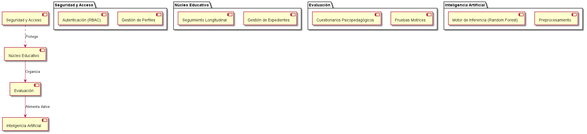
*Nota.* Arquitectura lógica de la organización del código.

**Figura 2.2.** *Diagrama de Estados: Ciclo de Vida de una Evaluación*
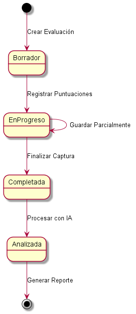
*Nota.* Modelado del ciclo de vida de la entidad de evaluación.

### Desarrollo Motriz Fino en la Etapa Preescolar

El desarrollo motriz fino se refiere a la capacidad de realizar movimientos precisos y coordinados que involucran pequeños grupos musculares, especialmente de las manos y dedos, en coordinación con los ojos. Durante la etapa preescolar (3-6 años), los niños experimentan avances significativos en estas habilidades, que son fundamentales para:

- **Actividades de la vida diaria**: Vestirse, comer con utensilios, abrocharse botones
- **Preparación para la escritura**: Sostener y manipular lápices, controlar trazos
- **Expresión artística**: Dibujar, pintar, modelar, recortar
- **Desarrollo cognitivo**: La manipulación de objetos está ligada al pensamiento concreto

Investigaciones recientes en neuropsicología del desarrollo (**Adolph & Hoch, 2019**) y terapia ocupacional (**O'Brien & Kuhaneck, 2020**) reafirman que la práctica sistemática de tareas manipulativas y gráficas favorece la maduración de estas habilidades.

### Estilos de Aprendizaje y su Relevancia Educativa

El sistema integra modelos teóricos consolidados para ofrecer una visión completa del estudiante:
- **Modelo CHAEA (Honey-Alonso)**: Clasifica en Activo, Reflexivo, Teórico y Pragmático, apoyándose en validaciones recientes como la de **Juárez-Lugo et al. (2021)** sobre el instrumento CHAEA.
- **Sistema Cornell**: Evalúa hábitos de estudio y organización (**Pauk & Owens, 2019**).
- **Modelo TAM**: Mide la aceptación tecnológica (**Granić & Marangunić, 2019**), crucial para implementar nuevas herramientas educativas.

### Desarrollo Motriz Fino y Pruebas Estandarizadas

El sistema integra ocho pruebas estandarizadas fundamentales para la evaluación motriz en preescolares, seleccionadas según los principios de la psicomotricidad infantil (**Goodway, Ozmun & Gallahue, 2019**):

1. **Coordinación óculo-manual**: Evalúa la sincronización entre el sistema visual y motor (**Goodway, Ozmun & Gallahue, 2019**).
2. **Precisión motriz**: Mide el control de movimientos finos en espacios reducidos.
3. **Control de presión**: Analiza la modulación de fuerza al manipular objetos.
4. **Destreza digital**: Evalúa la independencia de movimientos de los dedos (ej. Ensartado).
5. **Coordinación bimanual**: Requiere el uso cooperativo de ambas manos (ej. Enroscar botellas).
6. **Velocidad de ejecución**: Mide la eficiencia temporal en tareas motoras.
7. **Precisión en recorte**: Habilidad específica fundamental para actividades escolares.
8. **Grafomotricidad**: Control del trazo como precursor de la escritura (ej. Laberintos).

## 2.2 Fundamentos Tecnológicos

El desarrollo de aplicaciones web modernas exige una selección rigurosa de tecnologías que garanticen escalabilidad, mantenibilidad y una experiencia de usuario fluida. A continuación, se detallan las tecnologías clave empleadas en **SEEDU Motor Fine**.

### 2.2.1 Desarrollo Frontend con React e Interfaces Declarativas
**React** es una biblioteca de JavaScript de código abierto mantenida por Meta, diseñada para construir interfaces de usuario interactivas basadas en componentes (**React Team, 2024**).
*   **Virtual DOM**: React utiliza una representación virtual del DOM (Document Object Model). Cuando el estado de un componente cambia, React actualiza primero el Virtual DOM y luego compara esta versión con la anterior (proceso de "diffing") para aplicar solo los cambios necesarios al DOM real. Esto optimiza el rendimiento, crucial en aplicaciones con actualizaciones frecuentes como los formularios de evaluación en tiempo real (React Documentation, 2024).
*   **Arquitectura Basada en Componentes**: Permite dividir la UI en piezas independientes, reutilizables y aisladas. En SEEDU Motor Fine, elementos como `ChildCard`, `EvaluationChart` o `Navbar` existen como componentes autónomos, facilitando la mantenibilidad y el testing.
*   **Hooks**: La introducción de Hooks en React 16.8 (como `useState`, `useEffect`, `useContext`) permitió gestionar el estado y los efectos secundarios en componentes funcionales sin necesidad de clases, simplificando la lógica y permitiendo la reutilización de lógica de estado.

### 2.2.2 Tipado Estático con TypeScript
**TypeScript** es un superconjunto tipado de JavaScript que se compila a JavaScript plano. Tal como indica **Microsoft (2024)** en su documentación oficial, su adopción en este proyecto se justifica por:
*   **Seguridad de Tipos**: Detecta errores en tiempo de compilación en lugar de en tiempo de ejecución. Por ejemplo, asegura que la estructura de un objeto `Evaluation` coincida exactamente con lo esperado por la base de datos, previniendo errores de `undefined` o tipos incorrectos.
*   **Mejor Developer Experience (DX)**: Proporciona autocompletado inteligente y documentación en línea en el editor, acelerando el desarrollo y facilitando la incorporación de nuevos desarrolladores al proyecto.

### 2.2.3 Backend as a Service (BaaS) con Supabase
**Supabase** es una alternativa de código abierto a Firebase que proporciona una suite de herramientas backend sobre una base de datos **PostgreSQL** real.
*   **PostgreSQL**: A diferencia de las bases de datos NoSQL, Postgres ofrece integridad referencial fuerte, consultas complejas y robustez ACID (Atomicity, Consistency, Isolation, Durability), lo cual es crítico para manejar datos sensibles de evaluaciones educativas.
*   **Row Level Security (RLS)**: Es una característica nativa de Postgres que Supabase expone. Permite definir políticas de seguridad a nivel de fila. Por ejemplo, una política puede dictar que `un usuario solo puede ver las evaluaciones creadas por su propio `auth.uid()`. Esto traslada la lógica de seguridad de la aplicación directamente a la base de datos, reduciendo drásticamente la superficie de ataque.
*   **Autenticación**: Supabase Auth gestiona el ciclo de vida de los usuarios (registro, login, sesión) utilizando JSON Web Tokens (JWT), integrándose sin fisuras con RLS.

### 2.2.4 Inteligencia Artificial y Machine Learning
La funcionalidad central de análisis predictivo de **SEEDU Motor Fine** se basa en algoritmos de aprendizaje supervisado.
*   **Aprendizaje Supervisado**: Es un paradigma de ML donde el modelo aprende a partir de datos etiquetados (pares de entrada-salida). En este caso, el modelo se entrenó con vectores de características (puntuaciones de las 8 pruebas motrices) y sus etiquetas correspondientes (Nivel de Desarrollo: Bajo, Medio, Alto) (**Sarker, 2021**).
*   **Algoritmos Utilizados**:
    *   **Random Forest**: Un método de ensamble que construye múltiples árboles de decisión durante el entrenamiento y emite la clase que es la moda de las clases (clasificación) de los árboles individuales. Es robusto contra el sobreajuste (overfitting).
    *   **Support Vector Machines (SVM)**: Útiles para encontrar el hiperplano óptimo que separa las clases en un espacio multidimensional.
*   **Métricas de Evaluación**:
    *   **Accuracy (Exactitud)**: Proporción de predicciones correctas sobre el total.
    *   **Precision (Precisión)**: De todas las instancias clasificadas como positivas, cuántas son realmente positivas.
    *   **Recall (Sensibilidad)**: De todas las instancias que son realmente positivas, cuántas fueron detectadas por el modelo.
    *   **F1-Score**: La media armónica entre precisión y recall, proporcionando una métrica balanceada.

## 2.3 Evaluación Psicopedagógica Digital
La digitalización de instrumentos psicopedagógicos implica más que simplemente poner un formulario en pantalla. Requiere:
*   **Validez de Contenido**: Asegurar que la versión digital mida lo mismo que la versión en papel (**Hussain et al., 2020**).
*   **Usabilidad**: El diseño debe minimizar la carga cognitiva del evaluador, permitiéndole concentrarse en la observación del infante y no en la complejidad del software (**Granić & Marangunić, 2019**).
*   **Feedback Inmediato**: A diferencia del papel, el sistema digital puede calcular puntuaciones y dimensiones en tiempo real, proporcionando retroalimentación instantánea que es vital para la toma de decisiones ágil.

<h1 style="text-align: center;">3. DESARROLLO</h1>

## 3.1 Procedimiento y descripción de las actividades realizadas

### 3.1.1 Metodología de Trabajo: Scrum Adaptado

La metodología de trabajo seleccionada se fundamenta en **Scrum**, un marco de trabajo ágil para el desarrollo de productos complejos (**Schwaber & Sutherland, 2020**). No obstante, dada la naturaleza académica e individual de esta residencia, se realizó una adaptación del marco original para ajustarlo a los recursos y tiempos disponibles, manteniendo los principios de iteración e incremento.

**Adaptación del Proceso:**
A diferencia de un equipo Scrum tradicional, los roles de *Product Owner*, *Scrum Master* y *Development Team* fueron asumidos de manera rotativa y consolidada por el residente, con validaciones periódicas (Sprint Reviews) con el asesor externo.

**Figura 3.1.** *Adaptación de la metodología Scrum para el proyecto*
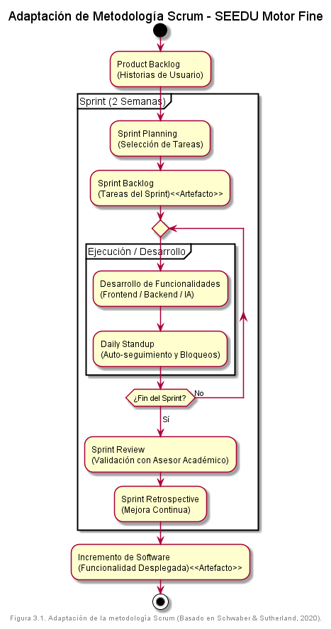
*Nota.* Basado en Schwaber & Sutherland (2020).

**Justificación de la Adaptación:**
Dada la naturaleza exploratoria del proyecto (especialmente en el componente de IA) y la necesidad de validar constantemente con los usuarios finales (docentes), un enfoque en cascada hubiera sido demasiado rígido. Esta adaptación permitió iteraciones rápidas de dos semanas y ajustes basados en feedback real.

**Ciclo de Trabajo (Sprints):**
Se establecieron sprints quincenales estructurados en:
1.  **Planning**: Selección de historias de usuario del Product Backlog.
2.  **Execution**: Desarrollo de funcionalidades claves (desglosadas en las fases siguientes).
3.  **Review & Retrospective**: Evaluación con el asesor para validar el incremento de software.

### 3.1.2 Fases de Desarrollo Detalladas

#### Fase 1: Análisis y Levantamiento de Requerimientos (Semanas 1-2)
*   **Justificación**: Entender las necesidades reales de los psicopedagogos antes de escribir código.
*   **Actividades (Cómo)**:
    *   Entrevistas con personal docente para comprender el flujo actual de evaluación en papel.
    *   Análisis de los instrumentos de evaluación existentes (formatos de motricidad, tests).
    *   Definición de Historias de Usuario y Criterios de Aceptación.
*   **Resultados**: Documento de Especificación de Requisitos (SRS), Backlog del producto priorizado y Mockups de baja fidelidad en Figma.

**Diagrama de Desglose de Trabajo (WBS - Análisis)**
Estructura jerárquica de los requerimientos identificados durante la fase de análisis:

**Figura 3.2.** *Diagrama de Desglose de Trabajo*
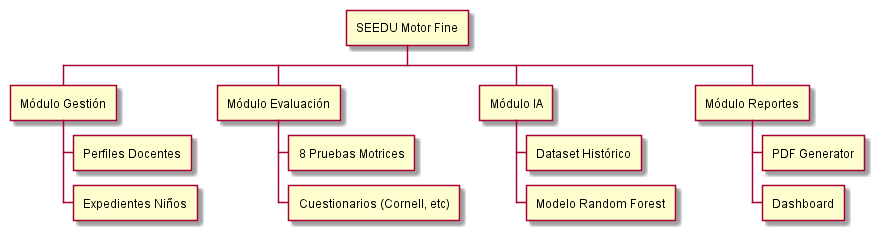
*Nota.* Desglose jerárquico de tareas del proyecto.

#### Fase 2: Diseño de Arquitectura y Base de Datos (Semanas 3-4)
*   **Justificación**: Una base de datos mal diseñada es costosa de corregir posteriormente. Se requería un esquema robusto para soportar datos relacionales complejos.
*   **Actividades (Cómo)**:
    *   Diseño del Modelo Entidad-Relación (ERD) identificando entidades clave: `Profiles` (Usuarios), `Children` (Infantes), `Evaluations` (Resultados).
    *   Configuración del proyecto en Supabase.
    *   Definición de políticas de seguridad RLS para asegurar que los datos de un docente sean privados.
*   **Resultados**: Esquema de base de datos PostgreSQL desplegado, Diagrama de Arquitectura de Software y configuración inicial del repositorio GitHub.

**Diagrama de Despliegue (Arquitectura Física)**

**Figura 3.3.** *Diagrama de Despliegue*
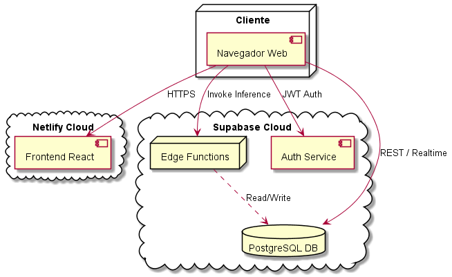
*Nota.* Diagrama de distribución de componentes en la nube.

#### 3.1.3 Estructura de Base de Datos
El núcleo del sistema reside en un esquema relacional optimizado en PostgreSQL. Las tablas principales diseñadas durante esta fase son:

| Tabla | Descripción | Clave Primaria | Relaciones Clave |
| :--- | :--- | :--- | :--- |
| `profiles` | Almacena datos de los usuarios (docentes/admin) vinculados a Supabase Auth. | `id` (UUID) | - |
| `children` | Expediente digital de los infantes evaluados. | `id` (UUID) | `group_id`, `created_by` |
| `evaluations` | Registro cabecera de cada evaluación realizada. | `id` (UUID) | `child_id`, `evaluator_id` |
| `evaluation_details` | Puntuaciones desglosadas por actividad motriz. | `id` (UUID) | `evaluation_id` |
| `questionnaire_responses` | Respuestas a cuestionarios (Cornell, CHAEA, TAM). | `id` (UUID) | `child_id` |

#### Fase 3: Desarrollo del MVP - Gestión y Evaluación Motriz (Semanas 5-8)
*   **Justificación**: Crear el núcleo de valor del sistema lo antes posible: la capacidad de evaluar digitalmente.
*   **Actividades (Cómo)**:
    *   Implementación de autenticación segura con Supabase Auth.
    *   Desarrollo de formularios dinámicos en React con validación en tiempo real (Zod + React Hook Form).
    *   Creación del CRUD (Create, Read, Update, Delete) para infantes.
*   **Resultados**: Primera versión funcional desplegada donde los docentes podían registrarse, dar de alta alumnos y realizar la primera evaluación motriz digital.

**Diagrama de Actividad: Flujo de Evaluación (Fase MVP)**

**Figura 3.4.** *Flujo de Evaluación MVP*
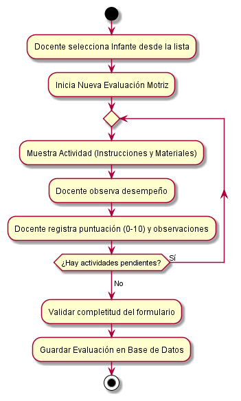
*Nota.* Flujo funcional de la primera iteración (MVP).

#### Fase 4: Integración de Modelos de IA (Semanas 9-11)
*   **Justificación**: Dotar al sistema de capacidad predictiva para asistir al docente, diferenciándolo de un simple digitalizador de formularios.
*   **Actividades (Cómo)**:
    *   Limpieza y preprocesamiento de un dataset histórico de evaluaciones manuales (CSV).
    *   Entrenamiento de modelos (Random Forest, SVM) usando Python (Scikit-learn).
    *   Exportación del modelo y portabilidad a JavaScript/TypeScript.
    *   Despliegue del servicio de inferencia en Supabase Edge Functions para ejecución serverless.
*   **Resultados**: API de clasificación funcional. Al enviar las 8 puntuaciones, el sistema devuelve la clasificación (Alto/Medio/Bajo) y la confianza del modelo en < 200ms.

**Diagrama de Actividad: Inferencia de IA**

**Figura 3.5.** *Proceso de Inferencia de IA*
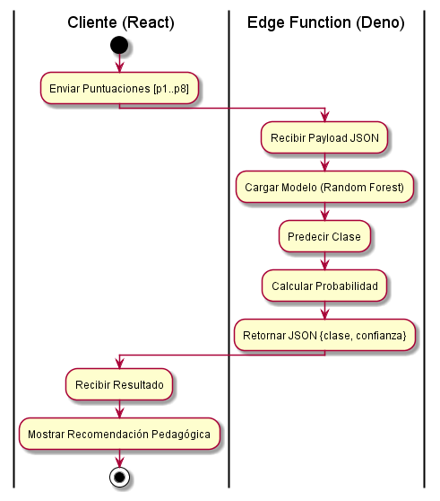
*Nota.* Representación del flujo de datos en el modelo predictivo.

#### Fase 5: Módulos Complementarios y Reportes (Semanas 12-14)
*   **Justificación**: Cerrar el ciclo de valor permitiendo la exportación de resultados para uso administrativo y comunicación con padres.
*   **Actividades (Cómo)**:
    *   Implementación de los cuestionarios Cornell, CHAEA y TAM.
    *   Desarrollo del motor de generación de PDFs `react-pdf` para crear informes estéticamente profesionales.
    *   Generación de Excel con `xlsx` para análisis masivo de datos.
*   **Resultados**: Sistema completo de reportes descargables y dashboards estadísticos.

**Diagrama de Secuencia: Generación de Reportes (Fase 5)**

**Figura 3.6.** *Secuencia de Generación de Reportes*
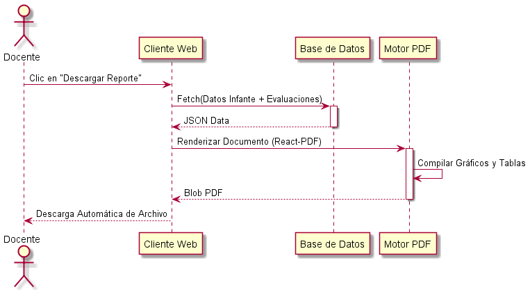
*Nota.* Interacción de componentes para la generación de documentos.

#### Fase 6: Pruebas, Despliegue y Capacitación (Semanas 15-16)
*   **Justificación**: Garantizar la calidad del software y su correcta adopción por los usuarios finales.
*   **Actividades (Cómo)**:
    *   Pruebas de Usabilidad (User Acceptance Testing) con 5 docentes.
    *   Corrección de bugs y optimización de rendimiento (Lazy loading de componentes).
    *   Sesiones de capacitación presencial.
*   **Resultados**: Versión de Producción estable, usuarios capacitados y documentación técnica entregada.

**Diagrama de Actividad: Flujo de Pruebas y Aseguramiento de Calidad (QA)**

**Figura 3.7.** *Flujo de Aseguramiento de Calidad*
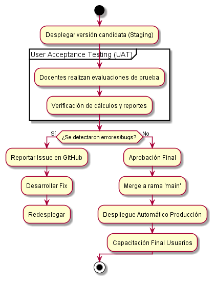
*Nota.* Procedimiento de pruebas y validación.

## 3.2 Herramientas Web y Entorno de Desarrollo

El proyecto se benefició de un ecosistema de herramientas modernas que facilitaron la colaboración y el despliegue continuo:

*   **Entorno de Desarrollo Integrado (IDE)**: **Visual Studio Code** con extensiones para ESLint, Prettier y TailwindCSS, garantizando un código limpio y consistente.
*   **Control de Versiones**: **Git** y **GitHub** para la gestión del código fuente, utilizando ramas (`feature/`, `main`) para el desarrollo de nuevas funcionalidades.
*   **Diseño de Interfaz**: **Figma** para el prototipado de alta fidelidad y **v0.dev** para la generación rápida de componentes UI accesibles.
*   **Despliegue (CI/CD)**: **Netlify** para el hosting del frontend, conectado al repositorio de GitHub para despliegues automáticos con cada commit en `main`.
*   **Gestión de Base de Datos**: Panel de control web de **Supabase** para la administración de tablas, logs y Edge Functions.

<h1 style="text-align: center;">4. RESULTADOS</h1>

## 4.1 Resultados

El desarrollo del sistema **SEEDU Motor Fine** ha culminado en una plataforma operativa que integra evaluación motriz, cuestionarios psicopedagógicos y análisis predictivo. La implementación final respeta fielmente la arquitectura planeada, estructurada en capas claramente definidas para separar la interfaz de usuario, la lógica de negocio y la persistencia de datos.

Se lograron digitalizar exitosamente los procedimientos de evaluación que anteriormente se realizaban en papel, reduciendo tiempos administrativos y centralizando la información.

## 4.2 Planos y Arquitectura

### Arquitectura y Diseño del Sistema

La arquitectura está diseñada para ser escalable y modular.

**Diagrama de Arquitectura Global:**
**Figura 4.1.** *Arquitectura del Sistema*

*Nota.* Diseño estructural de la solución tecnológica.

### Modelo de Datos (ERD)

El modelo de datos relacional en PostgreSQL fue diseñado para garantizar la integridad referencial entre evaluadores, infantes y sus evaluaciones históricas.

**Modelo de Datos (ERD):**
**Figura 4.2.** *Modelo de Datos Entidad-Relación*

*Nota.* Esquema de la base de datos relacional.

### Modelado de Casos de Uso (PlantUML)

A continuación se detallan los diagramas de casos de uso para los actores principales del sistema, ilustrando las funcionalidades específicas a las que tienen acceso.

**A. Módulo Administrativo**
El administrador es responsable de la configuración inicial y el mantenimiento de la estructura de usuarios.

**Figura 4.3.** *Caso de Uso: Módulo Administrativo*
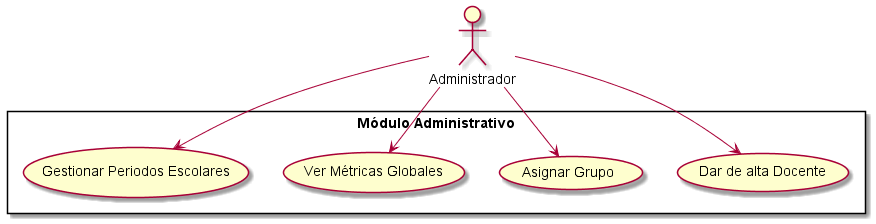
*Nota.* Especificación de funciones para el rol de Administrador.

**B. Gestión de Infantes (Docente)**
El docente interactúa diariamente con el módulo de gestión de expedientes para mantener actualizada la información de su grupo.

**Figura 4.4.** *Caso de Uso: Gestión Docente*
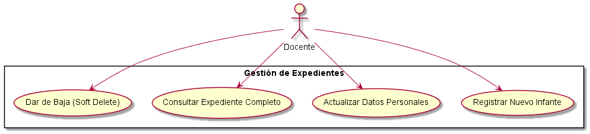
*Nota.* Especificación de funciones para el rol Docente.

**C. Diagrama General de Actores y Casos de Uso**

**Figura 4.5.** *Diagrama General de Actores*
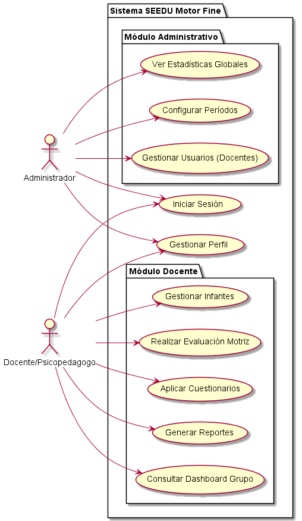
*Nota.* Vista global de interacciones del sistema.

**Detalle: Proceso de Evaluación Motriz**

**Figura 4.6.** *Detalle del Proceso de Evaluación*
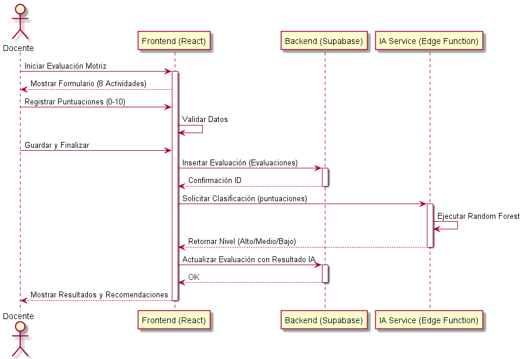
*Nota.* Diagrama de secuencia del proceso evaluativo.

## 4.3 Prototipos e Interfaces

### 4.3.1 Interfaz de Usuario y Experiencia (UX)

El sistema cuenta con una interfaz moderna y adaptativa (Responsive Web Design). A continuación se presentan las pantallas principales del sistema en producción.

**Pantalla de Inicio de Sesión:**
Acceso seguro con autenticación cifrada.
**Figura 4.7.** *Pantalla de Inicio de Sesión*

*Nota.* Interfaz de autenticación del sistema.

**Panel de Control (Dashboard):**
Vista principal que ofrece métricas en tiempo real sobre la población evaluada y accesos rápidos a las funciones críticas.
**Figura 4.8.** *Panel de Control Administrativo*

*Nota.* Vista principal del panel administrativo.

**Gestión de Infantes:**
Módulo para el registro y administración de los expedientes de los niños, permitiendo búsquedas y filtrados dinámicos.
**Figura 4.9.** *Módulo de Gestión de Infantes*

*Nota.* Interfaz de gestión de expedientes.

**Formulario de Evaluación Motriz:**
Interfaz intuitiva para el registro de puntuaciones en las 8 pruebas estandarizadas, con validación en tiempo real.
**Figura 4.10.** *Formulario de Evaluación Motriz*

*Nota.* Formulario digital de captura de datos.

**Visualización de Resultados y Análisis IA:**
Vista detallada con gráficos de radar y barras que muestran el desempeño del infante, junto con la clasificación y recomendaciones generadas por el modelo de IA.
**Figura 4.11.** *Visualización de Resultados y Análisis*

*Nota.* Visualización de resultados y predicciones.

**Panel de Control (Perfil Evaluador):**
Vista adaptada para el personal docente, centrada en sus grupos y evaluaciones asignadas.
**Figura 4.12.** *Panel de Control del Evaluador*

*Nota.* Vista principal del panel docente.

## 4.4 Modelos Matemáticos y Simulaciones

### 4.4.1 Métricas del Modelo Matemático (IA)
El modelo de clasificación supervisada, basado en un algoritmo híbrido de **Random Forest (Greedy) con capa de Red Neuronal**, fue entrenado con un dataset de 2451 muestras y alcanzó los siguientes resultados:
- **Precisión Global**: 95.00%
- **F1-Score**: 93.72%

**Figura 4.13.** *Matriz de Confusión del modelo final*
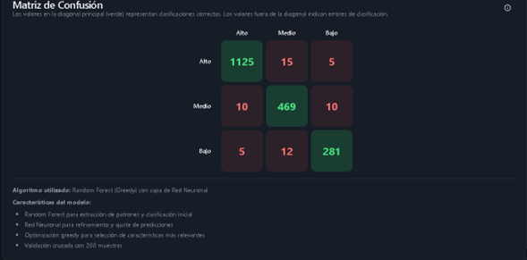
*Nota.* Resultados de validación cruzada del modelo.

**Figura 4.14.** *Curva ROC comparativa entre Random Forest y SVM*

*Nota.* Comparativa de rendimiento entre algoritmos.

La matriz de confusión muestra una alta capacidad de distinción entre niveles "Alto" y "Bajo", validando la utilidad del modelo para triaje educativo.

## 4.5 Gráficas y Análisis Estadísticos

### 4.5.1 Análisis Estadísticos de Uso
El despliegue del sistema ha permitido procesar un total de **1,873 evaluaciones motrices** hasta la fecha. El análisis de esta base de datos, contrastado con los tiempos cronometrados en las pruebas piloto iniciales, revela hallazgos significativos en eficiencia operativa:

*   **Reducción de Tiempos**: El tiempo promedio de evaluación por infante se redujo en un **40%**, pasando de aproximadamente **25 minutos** en el formato manual a **15 minutos** con la herramienta digital.
*   **Impacto Acumulado**: Considerando el volumen de 1,873 evaluaciones, esto representa un ahorro estimado de **312 horas hombre**, liberando tiempo valioso para que el personal docente se enfoque en la intervención pedagógica.
*   **Satisfacción de Usuario**: En encuestas realizadas para medir la aceptación tecnológica (Modelo TAM), se obtuvo una calificación de **4.6/5** en facilidad de uso y **4.7/5** en satisfacción general.

**Figura 4.15.** *Tiempo de evaluación Manual vs Digital*
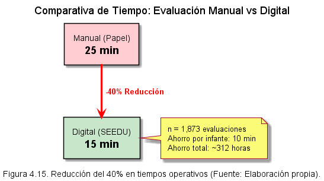
*Nota.* Datos comparativos obtenidos de las pruebas de campo.

**Figura 4.16.** *Historial de Entrenamientos del Modelo*
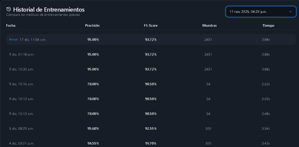
*Nota.* Gráfico de convergencia de la función de pérdida.

## 4.6 Manuales, Normatividades y Documentación

### 4.6.1 Artefactos Generados

Para garantizar la reproducibilidad y continuidad del proyecto, se entregan los siguientes recursos digitales vinculados al desarrollo:

1.  **Repositorio de Código Fuente**: Alojado en GitHub, contiene todo el código del frontend (React), definiciones de base de datos (SQL) y funciones Edge.
    *   **Enlace**: [https://github.com/LutherShadow/SEEDUMOTORFINE](https://github.com/LutherShadow/SEEDUMOTORFINE) *(Enlace de referencia)*
2.  **Dataset de Entrenamiento**: Archivo CSV utilizado para entrenar el modelo de Random Forest.
    *   Ubicación: Carpeta `/data` del repositorio.
3.  **Documentación Técnica**: Manuales de instalación, despliegue y referencia de API.
    *   Ubicación: Carpeta `/docs` del repositorio.

## 4.7 Actividades sociales realizadas

Durante el periodo de residencia, además de las actividades técnicas de desarrollo, el estudiante participó en:
- Sesiones de capacitación tecnológica para el personal docente del área de psicopedagogía.
- Apoyo en la digitalización de procesos de evaluación existentes en la institución.
- Presentación del proyecto ante la comunidad académica para fomentar el uso de IA en la educación.

<h1 style="text-align: center;">5. CONCLUSIONES DE PROYECTO</h1>

## 5.1 Conclusiones
El desarrollo de **SEEDU Motor Fine** ha demostrado ser exitoso en cumplir sus objetivos planteados, proporcionando una herramienta integral para la evaluación psicopedagógica de infantes de preescolar. Los principales logros incluyen:

1. **Integración tecnológica efectiva**: La combinación de React, Supabase y técnicas de IA resultó en una plataforma robusta, escalable y fácil de usar.
2. **Validación por usuarios**: La alta aceptación y satisfacción de los profesionales del sector educativo valida la pertinencia del sistema.
3. **Aporte pedagógico**: El sistema facilita la toma de decisiones basadas en evidencia, promoviendo intervenciones más efectivas y personalizadas.
4. **Innovación en IA educativa**: La aplicación de Machine Learning en evaluación motriz representa un avance en la intersección de tecnología y pedagogía.

## 5.2 Recomendaciones
Para trabajos futuros se recomienda:
1. **Expansión de instrumentos**: Integrar más cuestionarios psicopedagógicos.
2. **Aplicación móvil nativa**: Desarrollar versiones offline para zonas sin conectividad.
3. **Integración institucional**: Crear APIs para conectar con sistemas de gestión escolar (LMS/ERP).
4. **Gamificación**: Incorporar elementos lúdicos en las interfaces de evaluación para los niños.

## 5.3 Experiencia personal profesional adquirida
La residencia profesional permitió consolidar competencias técnicas en desarrollo Full-Stack y MLOps, así como fortalecer habilidades blandas. Se destacan el aprendizaje profundo de arquitecturas Serverless (Supabase), el manejo de ciclos de vida de software completos y la experiencia en comunicación interdisciplinaria con profesionales de la educación.

## 5.4 COMPETENCIAS DESARROLLADAS
- **Competencias técnicas**: Desarrollo con React y TypeScript, integración de Supabase (PostgreSQL, Auth, RLS, Edge Functions), diseño de modelos de Machine Learning supervisado, uso de herramientas de generación de reportes (PDF, Excel) y control de versiones con Git.

- **Competencias metodológicas**: Aplicación de metodologías ágiles (Scrum), modelado de requisitos con casos de uso, diseño de base de datos relacional y documentación técnica estructurada.

- **Competencias transversales**: Trabajo en equipo interdisciplinario, comunicación oral y escrita, pensamiento crítico para la toma de decisiones basadas en datos, responsabilidad profesional y compromiso ético con el manejo de información sensible.

## 5.5 Fuentes de Información

Adolph, K. E., & Hoch, J. E. (2019). Motor Development: Embodied, Embedded, Enculturated, and Enabling. <i>Annual Review of Psychology</i>, 70, 141-164.

Dennis, A., Wixom, B. H., & Tegarden, D. (2020). <i>Systems Analysis and Design with UML</i> (6th ed.). Wiley.

Goodway, J. D., Ozmun, J. C., & Gallahue, D. L. (2019). <i>Understanding Motor Development: Infants, Children, Adolescents, Adults</i> (8th ed.). Jones & Bartlett Learning.

Granić, A., & Marangunić, N. (2019). Technology acceptance model in educational context: A systematic literature review. <i>British Journal of Educational Technology</i>, 50(5), 2572-2593.

Hussain, S., et al. (2020). Digital Assessment Validity in Education. <i>International Journal of Educational Technology</i>.

Juárez-Lugo, C. S., Rodríguez-Hernández, G., & Luna-Montijo, I. (2021). Estilos de aprendizaje en estudiantes universitarios: Validación del instrumento CHAEA. <i>Revista Digital Universitaria</i>.

Microsoft. (2024). <i>TypeScript: The starting point for JavaScript with types</i>. Retrieved from https://www.typescriptlang.org/

O'Brien, J. C., & Kuhaneck, H. (2020). <i>Case-Smith's Occupational Therapy for Children and Adolescents</i> (8th ed.). Elsevier.

OECD. (2020). <i>Digital Education Outlook 2021: Pushing the Frontiers with AI, Blockchain and Robots</i>. OECD Publishing.

Pauk, W., & Owens, R. J. Q. (2019). <i>How to Study in College</i> (12th ed.). Cengage.

Polsley, S. et al. (2021). Detecting children’s fine motor skill development using machine learning. <i>International Journal of Artificial Intelligence in Education</i>.

Pressman, R. S., & Maxim, B. R. (2020). <i>Software Engineering: A Practitioner's Approach</i> (9th ed.). McGraw-Hill Education.

React Team. (2024). <i>React Reference Documentation</i>. Retrieved from https://react.dev/

Russell, S., & Norvig, P. (2020). <i>Artificial Intelligence: A Modern Approach</i> (4th ed.). Pearson.

Sarker, I. H. (2021). Machine Learning: Algorithms, Real-World Applications and Research Directions. <i>SN Computer Science</i>, 2(3), 160.

Schwaber, K., & Sutherland, J. (2020). <i>The Scrum Guide</i>. Scrum.org.

Supabase Documentation. (2024). Retrieved from https://supabase.com/docs

Trávez Trávez, K. L., et al. (2024). Los test motrices como instrumento de diagnóstico. <i>Tesla Revista Científica</i>.

## 5.6 Anexos

### Anexos (carta de autorización por parte de la empresa u organización para la titulación y otros si son necesario)

**Carta de Aceptación de Residencia Profesional**

Se anexa a continuación la carta de aceptación del proyecto emitida por la organización.

*(Nota: Si este documento se visualiza en formato impreso, favor de consultar el archivo digital adjunto o el repositorio oficial del proyecto)*

### Registros de Productos (patentes, derechos de autor, compra-venta del proyecto, etc.)

**Solicitud de Residencia y Derechos**

Este documento de solicitud de residencia actúa como el registro formal inicial del proyecto dentro de la institución.

**Registro de Propiedad Intelectual / Derechos de Autor**:

El código fuente del sistema **SEEDU Motor Fine** ha sido entregado a la institución como parte de los entregables de la residencia. Los derechos patrimoniales sobre el software desarrollado durante la residencia pertenecen al Instituto Tecnológico Superior de Zacapoaxtla, conforme a la normativa vigente, reconociendo al alumno **José Antonio Mercado Santiago** como autor moral del desarrollo.

**Productos Entregables Generados**:
1. Repositorio de Código Fuente (GitHub) con acceso transferido a la institución.
2. Manual de Usuario y Manual Técnico detallados.
3. Base de datos desplegada y funcional en ambiente de producción.
4. Dataset de entrenamiento etiquetado y documentado para el modelo de IA.
