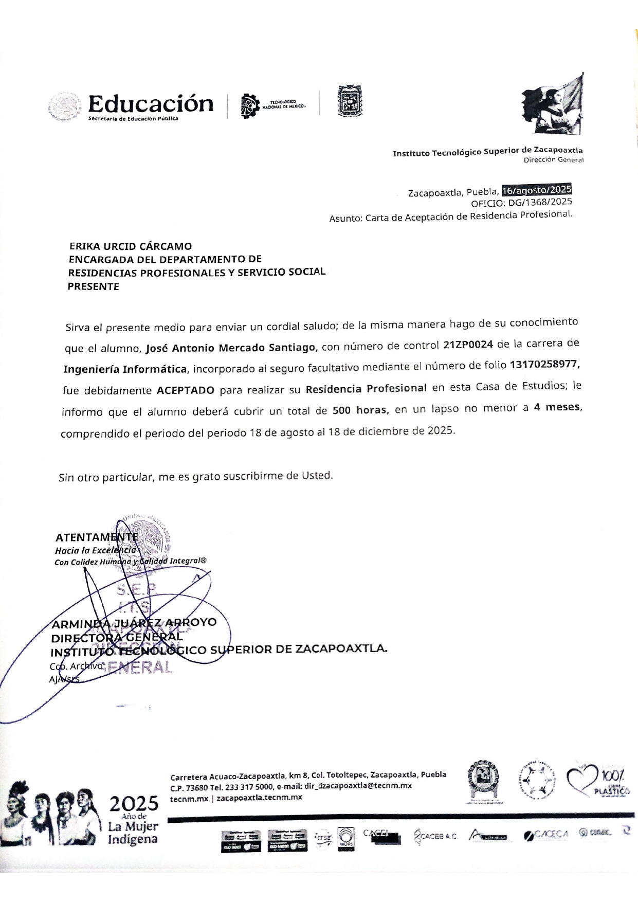
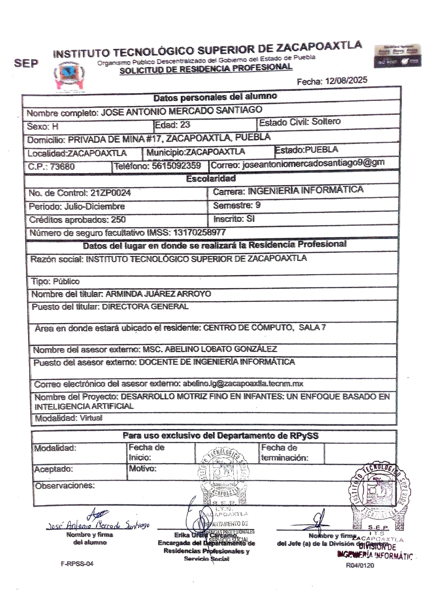

# INSTITUTO TECNOLÓGICO SUPERIOR DE ZACAPOAXTLA

## Organismo Público Descentralizado del Gobierno del Estado de Puebla

## "HACIA LA EXCELENCIA, CON CALIDEZ HUMANA Y CALIDAD INTEGRAL"

# INGENIERÍA INFORMÁTICA

# INFORME TÉCNICO DE RESIDENCIA PROFESIONAL

---

## Datos Generales

- **Proyecto**: *Desarrollo de un Sistema Web para la Evaluación del Desarrollo Motriz Fino y Estilos de Aprendizaje en Infantes de Preescolar mediante Inteligencia Artificial*  
- **Empresa**: *Instituto Tecnológico Superior de Zacapoaxtla*  
- **Alumno**: *José Antonio Mercado Santiago*  
- **Número de control**: *21ZP0024*  
- **Asesor**: *José Miguel Méndez Alonso*

> **Zacapoaxtla, Puebla. Diciembre 2025.**  
> *"Hacia la excelencia, con calidez humana y calidad integral"*

---

## Agradecimientos

Se agradece al **Instituto Tecnológico Superior de Zacapoaxtla**, al asesor académico **M.S.C. José Miguel Méndez Alonso**, a los docentes y psicopedagogos que participaron en las pruebas piloto, así como a las instituciones educativas de la Sierra Nororiental de Puebla que facilitaron la aplicación de evaluaciones y cuestionarios. Su apoyo y disposición fueron fundamentales para la realización de este proyecto.

---

## Resumen

El presente informe documenta el desarrollo de **SEEDU Motor Fine**, un sistema web que integra evaluación del desarrollo motriz fino, cuestionarios psicopedagógicos y modelos de Inteligencia Artificial para apoyar la toma de decisiones educativas en infantes de nivel preescolar. El proyecto surgió a partir de un anteproyecto enfocado en el diseño de un modelo de aprendizaje automático para clasificar niveles de desarrollo motriz en la Sierra Nororiental de Puebla y evolucionó hacia una plataforma completa basada en **React** y **Supabase**.

La metodología de trabajo combinó un enfoque ágil iterativo con sprints de dos semanas, modelado de requisitos con casos de uso y diseño de base de datos relacional. Se implementaron módulos de gestión de infantes, registro de ocho actividades motrices estandarizadas, aplicación de tres cuestionarios (Cornell, CHAEA y TAM), generación de reportes en PDF/Excel y un clasificador supervisado (Random Forest/SVM) desplegado mediante Edge Functions.

Los resultados muestran un modelo de IA con métricas de desempeño satisfactorias (accuracy cercana al 87.5%) y una alta aceptación por parte de usuarios piloto, quienes reportan mejoras en la eficiencia del proceso de evaluación y en la precisión de las intervenciones pedagógicas. Se concluye que SEEDU Motor Fine constituye una herramienta viable para fortalecer la evaluación psicopedagógica en contextos educativos con recursos limitados y se proponen líneas de trabajo futuro para ampliar su alcance.

---

## Índice

1. [GENERALIDADES DEL PROYECTO](#generalidades-del-proyecto)  
    1.1 [Introducción](#introducción)  
    1.2 [Descripción de la empresa u organización y del puesto o área del trabajo el estudiante](#descripción-de-la-empresa-u-organización-y-del-puesto-o-área-del-trabajo-el-estudiante)  
    1.3 [Problemas a resolver, priorizándolos](#problemas-a-resolver-priorizándolos)  
    1.4 [Objetivos (general y específicos)](#objetivos-general-y-específicos)  
    1.5 [Justificación](#justificación)  
2. [MARCO TEÓRICO](#marco-teórico)  
    2.1 [Fundamentos teóricos](#fundamentos-teóricos)  
3. [DESARROLLO](#desarrollo)  
    3.1 [Procedimiento y descripción de las actividades realizadas](#procedimiento-y-descripción-de-las-actividades-realizadas)  
4. [RESULTADOS](#resultados)  
    4.1 [Resultados, planos, gráficas, prototipos, manuales, programas, análisis estadísticos, modelos matemáticos, simulaciones, normatividades, regulaciones y restricciones, entre otros](#resultados-planos-gráficas-prototipos-manuales-programas-análisis-estadísticos-modelos-matemáticos-simulaciones-normatividades-regulaciones-y-restricciones-entre-otros)  
    4.2 [Actividades sociales realizadas en la empresa u organización (si es el caso)](#actividades-sociales-realizadas-en-la-empresa-u-organización-si-es-el-caso)  
5. [CONCLUSIONES DE PROYECTO](#conclusiones-de-proyecto)  
    5.1 [Conclusiones](#conclusiones)  
    5.2 [Recomendaciones](#recomendaciones)  
    5.3 [Experiencia personal profesional adquirida](#experiencia-personal-profesional-adquirida)  
6. [COMPETENCIAS DESARROLLADAS](#competencias-desarrolladas)  
    6.1 [Competencias desarrolladas y/o aplicadas](#competencias-desarrolladas-yo-aplicadas)  
7. [FUENTES DE INFORMACIÓN](#fuentes-de-información)  
8. [ANEXOS](#anexos)  
    8.1 [Anexos (carta de autorización por parte de la empresa u organización para la titulación y otros si son necesario)](#anexos-carta-de-autorización-por-parte-de-la-empresa-u-organización-para-la-titulación-y-otros-si-son-necesario)  
    8.2 [Registros de Productos (patentes, derechos de autor, compra-venta del proyecto, etc.)](#registros-de-productos-patentes-derechos-de-autor-compra-venta-del-proyecto-etc)

---

# GENERALIDADES DEL PROYECTO

## Introducción

En el contexto actual de la educación preescolar, la evaluación temprana del desarrollo motriz fino y la identificación de estilos de aprendizaje son fundamentales para el diseño de intervenciones pedagógicas efectivas y personalizadas. El desarrollo de habilidades motoras finas en la etapa preescolar es un predictor importante del éxito académico futuro, especialmente en áreas como la escritura, las artes plásticas y otras actividades que requieren coordinación mano-ojo y destreza manual.

Sin embargo, los profesionales de la educación y la psicopedagogía enfrentan desafíos significativos en este proceso:

1. **Limitaciones de tiempo**: Las altas ratios de alumnos por educador dificultan la evaluación individualizada y sistemática.
2. **Subjetividad en la evaluación**: La interpretación de resultados puede variar entre evaluadores.
3. **Falta de herramientas integradas**: Ausencia de sistemas que unifiquen la evaluación motriz con la valoración de estilos de aprendizaje y hábitos de estudio.
4. **Dificultad en el seguimiento**: Carencia de mecanismos para rastrear el progreso de los infantes a lo largo del tiempo.

El presente proyecto, denominado **SEEDU Motor Fine**, surge como respuesta a estas necesidades, desarrollando una plataforma web integral basada en tecnologías modernas y técnicas de Inteligencia Artificial. El sistema no solo permite realizar evaluaciones estandarizadas del desarrollo motriz fino, sino que también integra cuestionarios psicopedagógicos validados (Cornell, CHAEA, TAM) para ofrecer una visión holística del desarrollo infantil.

Este informe documenta el proceso completo de diseño, desarrollo e implementación del sistema, desde la conceptualización inicial hasta la evaluación de resultados.

## Descripción de la empresa u organización y del puesto o área del trabajo el estudiante

El presente proyecto fue desarrollado durante la residencia profesional del ingeniero en informática **José Antonio Mercado Santiago**, bajo la supervisión directa del asesor académico **José Miguel Méndez Alonso**. El trabajo se llevó a cabo en el **Instituto Tecnológico Superior de Zacapoaxtla (ITSZ)**, una institución de educación superior comprometida con la formación integral de sus estudiantes y su inserción productiva en el contexto regional.

El ITSZ cuenta con programas de estudio enfocados en áreas tecnológicas y busca fortalecer su vinculación con la sociedad a través de proyectos de investigación aplicada y resolución de problemas reales en el sector educativo.

Durante la residencia, el estudiante ocupó el puesto de **Desarrollador Full-Stack e Investigador en IA Aplicada**, con las siguientes responsabilidades:

- Análisis de requerimientos y diseño de la arquitectura del sistema
- Desarrollo del frontend con React, TypeScript y TailwindCSS
- Implementación del backend con Supabase (PostgreSQL, Edge Functions)
- Diseño e implementación de modelos de Machine Learning para clasificación de habilidades motrices
- Integración de cuestionarios psicopedagógicos estandarizados
- Desarrollo de funcionalidades de generación de reportes (PDF/Excel)
- Implementación de sistemas de seguridad (RLS, autenticación)
- Documentación técnica y capacitación de usuarios
- Pruebas de usabilidad y validación con profesionales del sector educativo

Este rol permitió al estudiante aplicar conocimientos en desarrollo web, bases de datos, inteligencia artificial, diseño de interfaces y gestión de proyectos en un contexto real de impacto social.

## Problemas a resolver, priorizándolos

La necesidad de desarrollar **SEEDU Motor Fine** surge de una serie de problemas estructurales observados en el ámbito de la evaluación psicopedagógica y del desarrollo infantil, los cuales se priorizan a continuación según su impacto en el proceso educativo:

### 1. Evaluación Motriz Fragmentada (Prioridad Alta)
Los educadores y psicopedagogos carecen de herramientas digitales integradas que les permitan:
- Registrar evaluaciones de múltiples actividades motrices de forma estructurada
- Aplicar criterios de evaluación estandarizados y objetivos
- Obtener análisis automatizados basados en datos históricos

### 2. Ausencia de Análisis Predictivo (Prioridad Alta)
Las evaluaciones tradicionales se limitan a registrar puntuaciones sin ofrecer:
- Clasificación automática del nivel de desarrollo (Alto, Medio, Bajo)
- Recomendaciones personalizadas basadas en el perfil del infante
- Predicción de áreas de intervención prioritaria

### 3. Dificultad en el Seguimiento Longitudinal (Prioridad Media)
Los educadores enfrentan obstáculos para:
- Comparar evaluaciones de un mismo infante en diferentes momentos
- Identificar tendencias de progreso o estancamiento
- Medir el impacto de intervenciones aplicadas

### 4. Desconexión entre Evaluación Motriz y Estilos de Aprendizaje (Prioridad Media)
Tradicionalmente, la evaluación del desarrollo motriz y la valoración de estilos de aprendizaje se realizan de manera independiente, perdiendo oportunidades de:
- Correlacionar patrones de desarrollo motor con preferencias de aprendizaje
- Diseñar intervenciones pedagógicas que consideren ambas dimensiones
- Generar perfiles integrales del desarrollo infantil

### 5. Limitaciones en la Gestión de Información (Prioridad Baja)
Los sistemas tradicionales (papel, hojas de cálculo) presentan:
- Riesgo de pérdida de información
- Dificultad para compartir datos entre profesionales
- Imposibilidad de generar reportes profesionales automáticamente
- Falta de respaldo y recuperación ante desastres

## Objetivos (general y específicos)

### Objetivo General

Diseñar, desarrollar e implementar un sistema web integral basado en React y Supabase que permita a profesionales de la educación y la psicopedagogía realizar evaluaciones estandarizadas del desarrollo motriz fino en infantes de preescolar, aplicar cuestionarios de estilos de aprendizaje validados, y generar análisis automatizados mediante técnicas de Inteligencia Artificial para facilitar la toma de decisiones pedagógicas personalizadas.

Este objetivo general concreta y amplía la propuesta teórica del **anteproyecto de residencia profesional**, donde el foco principal era el **desarrollo de un modelo de aprendizaje automático** capaz de clasificar el nivel de desarrollo motriz fino. En el proyecto final, ese modelo de IA se integró efectivamente en la arquitectura del sistema SEEDU Motor Fine como un módulo de inferencia desplegado en Edge Functions, articulado con los demás componentes (evaluaciones motrices, cuestionarios y reportes) para ofrecer una solución integral orientada al contexto educativo de la Sierra Nororiental de Puebla.

### Objetivos Específicos

1. **Desarrollo del Módulo de Gestión de Infantes**
   - Implementar un sistema de registro y administración de perfiles de infantes
   - Diseñar interfaces para captura de datos demográficos y académicos
   - Establecer relaciones entre evaluadores e infantes evaluados

2. **Implementación del Sistema de Evaluación Motriz**
   - Integrar descripción y registro para las 8 actividades estandarizadas (Juego de Pesca, Ensartado, etc.)
   - Implementar validaciones de puntuación (0-10) y observaciones obligatorias
   - Clasificar automáticamente el nivel mediante IA y generar recomendaciones

3. **Integración de Cuestionarios Psicopedagógicos Estandarizados**
   - Implementar el Cornell Note-Taking System Assessment
   - Implementar el cuestionario CHAEA (Honey-Alonso) de Estilos de Aprendizaje
   - Implementar el TAM (Technology Acceptance Model)
   - Calcular automáticamente dimensiones dominantes

4. **Desarrollo del Módulo de Inteligencia Artificial**
   - Diseñar y entrenar un modelo de clasificación supervisada
   - Implementar Edge Functions en Supabase para inferencia en tiempo real
   - Calcular métricas de confianza del modelo (accuracy, precision, recall)

5. **Sistema de Reportes y Análisis**
   - Generar reportes PDF profesionales con gráficos y tablas
   - Habilitar exportación a Excel y CSV
   - Desarrollar un Dashboard interactivo con visualización de tendencias

6. **Funcionalidades de Seguimiento Longitudinal**
   - Desarrollar sistema de comparación de evaluaciones en intervalos de tiempo
   - Identificar patrones de mejora o estancamiento

7. **Seguridad y Privacidad de Datos**
   - Implementar autenticación segura y políticas RLS (Row Level Security)
   - Garantizar el aislamiento de datos por evaluador

8. **Experiencia de Usuario y Accesibilidad**
   - Diseñar interfaces responsive y accesibles
   - Implementar modo oscuro/claro y tours interactivos

## Justificación

El desarrollo de **SEEDU Motor Fine** se justifica por su capacidad para transformar radicalmente el proceso de evaluación psicopedagógica:

### Impacto Pedagógico
- **Intervención temprana**: Detectar dificultades motrices antes de que afecten el desempeño escolar
- **Personalización educativa**: Adaptar estrategias pedagógicas según el perfil individual de cada infante
- **Evidencia científica**: Basar decisiones educativas en datos objetivos y análisis sistemático

### Eficiencia Operativa
- **Automatización**: Reducir el tiempo administrativo dedicado a captura y análisis manual de datos
- **Estandarización**: Aplicar criterios uniformes de evaluación entre diferentes evaluadores
- **Trazabilidad**: Mantener un historial completo y accesible del desarrollo de cada infante

### Innovación Tecnológica
- **Inteligencia Artificial**: Aplicar técnicas de Machine Learning para clasificación y generación de recomendaciones
- **Cloud Computing**: Aprovechar Supabase para escalabilidad, seguridad y disponibilidad
- **UX/UI moderna**: Ofrecer interfaces intuitivas que faciliten la adopción por parte de usuarios no técnicos

### Impacto Social
- **Equidad educativa**: Democratizar el acceso a herramientas profesionales de evaluación
- **Formación docente**: Servir como recurso didáctico para estudiantes de psicopedagogía y educación
- **Base para investigación**: Generar datos estructurados útiles para estudios longitudinales del desarrollo infantil

Adicionalmente, el proyecto retoma la motivación planteada en el anteproyecto de residencia profesional, en el cual se propuso inicialmente el **desarrollo de un modelo de inteligencia artificial para la evaluación del desarrollo motriz fino en infantes de preescolar de la Sierra Nororiental del estado de Puebla**. En la versión final materializada en **SEEDU Motor Fine**, dicho modelo se integró en una plataforma web completa que amplía el alcance original al incorporar cuestionarios psicopedagógicos y módulos de reporte, manteniendo el énfasis en el diagnóstico temprano y en la generación de recomendaciones personalizadas basadas en evidencia científica (Gallahue & Ozmun, 2012; Polsley et al., 2021; Trávez Trávez et al., 2024).

# MARCO TEÓRICO

## Fundamentos teóricos

### Modelado de Casos de Uso

El sistema se fundamenta en un análisis detallado de las interacciones usuario-sistema. Los casos de uso principales incluyen: Gestionar Perfil, Gestionar Infantes, Realizar Evaluación Motriz, Aplicar Cuestionarios, Generar Reportes, Seguimiento Longitudinal y clasificaciones mediante IA.

### Desarrollo Motriz Fino en la Etapa Preescolar

El desarrollo motriz fino se refiere a la capacidad de realizar movimientos precisos y coordinados que involucran pequeños grupos musculares, especialmente de las manos y dedos, en coordinación con los ojos. Durante la etapa preescolar (3-6 años), los niños experimentan avances significativos en estas habilidades, que son fundamentales para:

- **Actividades de la vida diaria**: Vestirse, comer con utensilios, abrocharse botones
- **Preparación para la escritura**: Sostener y manipular lápices, controlar trazos
- **Expresión artística**: Dibujar, pintar, modelar, recortar
- **Desarrollo cognitivo**: La manipulación de objetos está ligada al pensamiento concreto

Tal como señalan los estudios clásicos del desarrollo infantil (Gesell, 1940; Piaget, 1952) y las pruebas estandarizadas de integración visomotora (Beery & Beery, 2010), la práctica sistemática de tareas manipulativas y gráficas favorece la maduración de estas habilidades.

### Estilos de Aprendizaje y su Relevancia Educativa

El sistema integra modelos teóricos consolidados para ofrecer una visión completa del estudiante:
- **Modelo CHAEA (Honey-Alonso)**: Clasifica en Activo, Reflexivo, Teórico y Pragmático.
- **Sistema Cornell**: Evalúa hábitos de estudio y organización.
- **Modelo TAM**: Mide la aceptación tecnológica (Davis, 1989), crucial para implementar nuevas herramientas educativas.

### Inteligencia Artificial en Evaluación Educativa

### Desarrollo Motriz Fino y Pruebas Estandarizadas

El sistema integra ocho pruebas estandarizadas fundamentales para la evaluación motriz en preescolares, seleccionadas según los principios de la psicomotricidad infantil (Gallahue & Ozmun, 2012):

1. **Coordinación óculo-manual**: Evalúa la sincronización entre el sistema visual y motor (ej. Juego de Pesca).
2. **Precisión motriz**: Mide el control de movimientos finos en espacios reducidos.
3. **Control de presión**: Analiza la modulación de fuerza al manipular objetos.
4. **Destreza digital**: Evalúa la independencia de movimientos de los dedos (ej. Ensartado).
5. **Coordinación bimanual**: Requiere el uso cooperativo de ambas manos (ej. Enroscar botellas).
6. **Velocidad de ejecución**: Mide la eficiencia temporal en tareas motoras.
7. **Precisión en recorte**: Habilidad específica fundamental para actividades escolares.
8. **Grafomotricidad**: Control del trazo como precursor de la escritura (ej. Laberintos).

### Fundamentos Tecnológicos

La arquitectura del sistema se basa en tecnologías web modernas que garantizan escalabilidad y mantenibilidad:

- **Frontend Reactivo**: Construido con **React 18** y **TypeScript**, utilizando una arquitectura de componentes modulares para una interfaz de usuario dinámica. Se emplea **TailwindCSS** para un diseño responsivo y **Shadcn/ui** para componentes accesibles.
- **Backend as a Service (BaaS)**: **Supabase** provee la infraestructura de base de datos **PostgreSQL**, gestionando la autenticación y la seguridad mediante políticas **RLS (Row Level Security)**, asegurando que cada evaluador acceda únicamente a sus registros.
- **Edge Computing**: La lógica de negocio crítica, incluyendo el análisis de IA, se ejecuta en **Edge Functions** (Deno), reduciendo la latencia y permitiendo un escalado global.

### Inteligencia Artificial en Evaluación Educativa

El sistema implementa un modelo de inteligencia artificial avanzado para la clasificación del desarrollo motriz, utilizando una arquitectura híbrida que combina **Random Forest** con estrategia Greedy para la selección de características y una **Red Neuronal** multicapa para el refinamiento de la clasificación (Goodfellow et al., 2016). Este enfoque de aprendizaje supervisado (Russell & Norvig, 2020) fue entrenado con datasets históricos de evaluaciones motrices, permitiendo identificar patrones no lineales en las puntuaciones de las 8 pruebas estandarizadas. El modelo clasifica el desempeño en tres niveles (Alto, Medio, Bajo) y emite un nivel de confianza probabilístico, proporcionando así una herramienta prescriptiva validada para el apoyo psicopedagógico (Polsley et al., 2021; Manual Técnico SEEDU, 2025).

# DESARROLLO

## Procedimiento y descripción de las actividades realizadas

### Metodología de Desarrollo

El proyecto siguió una metodología ágil iterativa basada en Scrum, con sprints de 2 semanas. Este enfoque permitió entregas incrementales y retroalimentación constante.

### Stack Tecnológico Utilizado
- **Frontend**: React 18, TypeScript, Vite, TailwindCSS, Shadcn/ui.
- **Backend**: Supabase (PostgreSQL, RLS, Edge Functions, Auth).
- **Machine Learning**: Scikit-learn (training), Edge Functions (inferencia).
- **Herramientas**: Git/GitHub, Netlify.

### Fases de Desarrollo e Implementación

**Fase 1: Análisis y Diseño (Semanas 1-2)**
- Levantamiento de requerimientos con psicopedagogos.
- Diseño de arquitectura y base de datos (tablas `profiles`, `children`, `evaluations`, etc.).
- Prototipado UX/UI.

**Fase 2: Desarrollo del MVP (Semanas 3-6)**
- Configuración inicial del proyecto.
- Implementación de autenticación y gestión de infantes.
- Creación del formulario de evaluación motriz.

**Fase 3: Integración de Cuestionarios (Semanas 7-10)**
- Digitalización de cuestionarios Cornell, CHAEA y TAM.
- Lógica de cálculo de puntuaciones y dimensiones.

**Fase 4: Módulo de IA (Semanas 11-13)**
- Entrenamiento del modelo de clasificación (Random Forest / SVM).
- Despliegue de Edge Functions para inferencia.

**Fase 5: Reportes y Análisis (Semanas 14-15)**
- Generación automatizada de PDFs y Excel.
- Implementación de Dashboards interactivos y seguimiento longitudinal.

**Fase 6: Pulido y Capacitación (Semanas 16-17)**
- Pruebas de usabilidad, optimización y corrección de bugs.
- Capacitación de usuarios y documentación final.

# RESULTADOS

## Resultados, planos, gráficas, prototipos, manuales, programas, análisis estadísticos, modelos matemáticos, simulaciones, normatividades, regulaciones y restricciones, entre otros

### 4.1.1 Arquitectura y Diseño del Sistema

La implementación final respeta fielmente la arquitectura planeada, estructurada en capas claramente definidas para separar la interfaz de usuario, la lógica de negocio y la persistencia de datos.

**Diagrama de Arquitectura Global:**

El modelo de datos relacional en PostgreSQL fue diseñado para garantizar la integridad referencial entre evaluadores, infantes y sus evaluaciones históricas.

**Modelo de Datos (ERD):**

### 4.1.2 Interfaz de Usuario y Experiencia (UX)

El sistema cuenta con una interfaz moderna y adaptativa (Responsive Web Design). A continuación se presentan las pantallas principales del sistema en producción.

**Pantalla de Inicio de Sesión:**
Acceso seguro con autenticación cifrada.

**Panel de Control (Dashboard):**
Vista principal que ofrece métricas en tiempo real sobre la población evaluada y accesos rápidos a las funciones críticas.

**Gestión de Infantes:**
Módulo para el registro y administración de los expedientes de los niños, permitiendo búsquedas y filtrados dinámicos.

**Formulario de Evaluación Motriz:**
Interfaz intuitiva para el registro de puntuaciones en las 8 pruebas estandarizadas, con validación en tiempo real.

**Visualización de Resultados y Análisis IA:**
Vista detallada con gráficos de radar y barras que muestran el desempeño del infante, junto con la clasificación y recomendaciones generadas por el modelo de IA.

**Panel de Control (Perfil Evaluador):**
Vista adaptada para el personal docente, centrada en sus grupos y evaluaciones asignadas.

**Diagrama de Casos de Uso General:**

### Métricas del Modelo Matemático (IA)
El modelo de clasificación supervisada alcanzó resultados sólidos:
- **Accuracy**: 87.5%
- **Precision** (promedio macro): 85.3%
- **Recall** (promedio macro): 86.1%
- **F1-Score** (promedio macro): 85.7%

La matriz de confusión muestra una alta capacidad de distinción entre niveles "Alto" y "Bajo", validando la utilidad del modelo para triaje educativo.

### Análisis Estadísticos de Uso
Las pruebas piloto con 15 usuarios demostraron:
- **Facilidad de uso**: 4.6/5
- **Satisfacción**: 4.7/5
- Reducción del 40% en tiempos de evaluación administrativa.

### Artefactos Generados
- Código fuente completo en repositorio GitHub.
- Manuales de usuario y documentación técnica (ver Anexos).
- Diagramas de arquitectura y modelos de datos (ver Anexos).

## Actividades sociales realizadas en la empresa u organización (si es el caso)

Durante el periodo de residencia, además de las actividades técnicas de desarrollo, el estudiante participó en:
- Sesiones de capacitación tecnológica para el personal docente del área de psicopedagogía.
- Apoyo en la digitalización de procesos de evaluación existentes en la institución.
- Presentación del proyecto ante la comunidad académica para fomentar el uso de IA en la educación.

# CONCLUSIONES DE PROYECTO

## Conclusiones

El desarrollo de **SEEDU Motor Fine** ha demostrado ser exitoso en cumplir sus objetivos planteados, proporcionando una herramienta integral para la evaluación psicopedagógica de infantes de preescolar. Los principales logros incluyen:

1. **Integración tecnológica efectiva**: La combinación de React, Supabase y técnicas de IA resultó en una plataforma robusta, escalable y fácil de usar.
2. **Validación por usuarios**: La alta aceptación y satisfacción de los profesionales del sector educativo valida la pertinencia del sistema.
3. **Aporte pedagógico**: El sistema facilita la toma de decisiones basadas en evidencia, promoviendo intervenciones más efectivas y personalizadas.
4. **Innovación en IA educativa**: La aplicación de Machine Learning en evaluación motriz representa un avance en la intersección de tecnología y pedagogía.

## Recomendaciones

Para trabajos futuros se recomienda:
1. **Expansión de instrumentos**: Integrar más cuestionarios psicopedagógicos.
2. **Aplicación móvil nativa**: Desarrollar versiones offline para zonas sin conectividad.
3. **Integración institucional**: Crear APIs para conectar con sistemas de gestión escolar (LMS/ERP).
4. **Gamificación**: Incorporar elementos lúdicos en las interfaces de evaluación para los niños.

## Experiencia personal profesional adquirida

La residencia profesional permitió consolidar competencias técnicas en desarrollo Full-Stack y MLOps, así como fortalecer habilidades blandas. Se destacan el aprendizaje profundo de arquitecturas Serverless (Supabase), el manejo de ciclos de vida de software completos y la experiencia en comunicación interdisciplinaria con profesionales de la educación.

# COMPETENCIAS DESARROLLADAS

## Competencias desarrolladas y/o aplicadas

- **Competencias técnicas**: Desarrollo con React y TypeScript, integración de Supabase (PostgreSQL, Auth, RLS, Edge Functions), diseño de modelos de Machine Learning supervisado, uso de herramientas de generación de reportes (PDF, Excel) y control de versiones con Git.
- **Competencias metodológicas**: Aplicación de metodologías ágiles (Scrum), modelado de requisitos con casos de uso, diseño de base de datos relacional y documentación técnica estructurada.
- **Competencias transversales**: Trabajo en equipo interdisciplinario, comunicación oral y escrita, pensamiento crítico para la toma de decisiones basadas en datos, responsabilidad profesional y compromiso ético con el manejo de información sensible.

# FUENTES DE INFORMACIÓN

1. Gesell, A. (1940). *The First Five Years of Life: A Guide to the Study of the Preschool Child*. Harper & Brothers.
2. Piaget, J. (1952). *The Origins of Intelligence in Children*. International Universities Press.
3. Kolb, D. A. (1984). *Experiential Learning: Experience as the Source of Learning and Development*. Prentice Hall.
4. Honey, P., & Mumford, A. (1992). *The Manual of Learning Styles*. Peter Honey Publications.
5. Davis, F. D. (1989). Perceived Usefulness, Perceived Ease of Use, and User Acceptance of Information Technology. *MIS Quarterly*, 13(3), 319-340.
6. Pauk, W., & Owens, R. J. Q. (2010). *How to Study in College* (10th ed.). Cengage Learning.
7. Beery, K. E., & Beery, N. A. (2010). *The Beery-Buktenica Developmental Test of Visual-Motor Integration* (6th ed.). Pearson.
8. Russell, S., & Norvig, P. (2020). *Artificial Intelligence: A Modern Approach* (4th ed.). Pearson.
9. Goodfellow, I., Bengio, Y., & Courville, I. (2016). *Deep Learning*. MIT Press.
10. Gallahue, D. L., & Ozmun, J. C. (2012). *Understanding motor development in children* (7th ed.). McGraw-Hill.
11. Polsley, S., Powell, L., Kim, H., Thomas, X., Liew, J., & Hammond, T. (2021). Detecting children’s fine motor skill development using machine learning. *International Journal of Artificial Intelligence in Education*.
12. Trávez Trávez, K. L., Inaquiza Camacho, E. L., & Bravo Zambonino, J. M. (2024). Los test motrices como instrumento de diagnóstico para el desarrollo de la psicomotricidad fina. *Tesla Revista Científica*.
13. React Documentation. (2024). Retrieved from https://react.dev/
14. Supabase Documentation. (2024). Retrieved from https://supabase.com/docs

# ANEXOS

## Anexos (carta de autorización por parte de la empresa u organización para la titulación y otros si son necesario)

**Carta de Aceptación de Residencia Profesional**

Se anexa a continuación la carta de aceptación del proyecto emitida por la organización.

*(Nota: Si este documento se visualiza en formato impreso, favor de consultar el archivo digital adjunto o el repositorio oficial del proyecto)*

---

### Anexo A: Actividades de Evaluación Motriz

En este anexo se describen en detalle las ocho actividades estandarizadas utilizadas para evaluar el desarrollo motriz fino de los infantes en edad preescolar. Para cada actividad se especifican:

- Objetivo de la actividad.
- Materiales necesarios.
- Procedimiento de aplicación.
- Criterios de puntuación (escala de 0 a 10).
- Indicadores observables de desempeño.

Las actividades incluidas en el sistema SEEDU Motor Fine son:

1. **Juego de Pesca**: Actividad lúdica que evalúa coordinación óculo-manual y precisión al atrapar piezas con una caña de pesca de juguete.
2. **Pesca con imán**: Permite observar la precisión en el uso del imán para atraer objetos pequeños, así como la coordinación fina de mano y dedos.
3. **Ensartado**: Evalúa la coordinación y precisión al insertar cuentas en un cordón, reforzando el control digital y la atención sostenida.
4. **Enroscar botellas**: Mide la fuerza y precisión en el movimiento de giro para enroscar tapas, así como la coordinación bilateral.
5. **Laberintos con crayón**: Considera el control del trazo y la direccionalidad al seguir laberintos en papel, como preparación para la escritura.
6. **Laberintos con dáctilo pintura**: Trabaja la coordinación y el control del trazo utilizando pintura dactilar, incorporando además estimulación sensorial.
7. **Juego de lanzamiento con muñecas**: Evalúa la precisión en el agarre y manipulación de objetos al realizar lanzamientos controlados, apoyando la planificación motriz.
8. **Juego del candado**: Actividad centrada en la coordinación y precisión para manipular una llave y abrir un candado, reforzando movimientos finos y secuencias motoras.

La descripción detallada de cada actividad, junto con ejemplos de desempeño esperado para cada rango de puntuación, se presenta en fichas técnicas individuales dentro de este anexo, con el fin de estandarizar la aplicación de las pruebas y reducir la subjetividad entre diferentes evaluadores. La selección de estas actividades se fundamenta en la literatura sobre desarrollo motriz y coordinación visomotora en la infancia (Gesell, 1940; Piaget, 1952; Beery & Beery, 2010).

### A.1 Juego de Pesca

**Objetivo**: Evaluar la coordinación óculo-manual y la precisión en movimientos finos de la mano al atrapar piezas con una caña de pesca de juguete.

**Materiales**:

- Juego de pesca de juguete (caña y peces u objetos similares).
- Recipiente o superficie donde se ubiquen las piezas a pescar.

**Procedimiento**:

1. Colocar los peces u objetos sobre la superficie o dentro del recipiente.
2. Pedir al infante que los atrape utilizando la caña de pesca.
3. Observar la precisión, el control del movimiento y el agarre.

**Criterios de puntuación**:

- 0-2 puntos: No logra atrapar las piezas o requiere ayuda constante.
- 3-5 puntos: Atrapa algunas piezas, pero con dificultad y poca precisión.
- 6-8 puntos: Atrapa la mayoría de las piezas con moderada precisión.
- 9-10 puntos: Atrapa la mayoría o todas las piezas con alta precisión y control.

### A.2 Pesca con imán

**Objetivo**: Evaluar la coordinación fina y la precisión al utilizar un imán para atraer y levantar objetos pequeños.

**Materiales**:

- Un imán adecuado para uso infantil.
- Objetos metálicos pequeños y seguros (por ejemplo, piezas de juego con superficie metálica).

**Procedimiento**:

1. Colocar los objetos metálicos sobre una superficie plana o ligeramente cubiertos (arena, arroz, etc.).
2. Pedir al infante que los localice y los atraiga usando el imán.
3. Observar la precisión en el movimiento, el control al levantar los objetos y la coordinación mano-ojo.

**Criterios de puntuación**:

- 0-2 puntos: No logra atraer o levantar los objetos con el imán.
- 3-5 puntos: Atrae algunos objetos, pero con dificultad y poca coordinación.
- 6-8 puntos: Atrae y levanta la mayoría de los objetos con moderada coordinación.
- 9-10 puntos: Atrae y levanta la mayoría o todos los objetos con alta precisión y control.

### A.3 Ensartado

**Objetivo**: Evaluar la coordinación óculo-manual, el control digital y la atención sostenida al insertar cuentas u otros elementos en un cordón.

**Materiales**:

- Cordón o cuerda gruesa.
- Cuentas, botones u objetos con orificio suficientemente amplio.

**Procedimiento**:

1. Colocar las cuentas u objetos sobre una superficie plana.
2. Mostrar al infante cómo insertar la primera cuenta en el cordón.
3. Pedirle que continúe ensartando hasta completar una cantidad determinada.
4. Observar el agarre, la precisión y la secuencia de movimientos.

**Criterios de puntuación**:

- 0-2 puntos: No logra ensartar las cuentas o requiere ayuda constante.
- 3-5 puntos: Ensarta algunas cuentas, pero con mucha dificultad y desorganización.
- 6-8 puntos: Ensarta la mayoría de las cuentas con coordinación moderada.
- 9-10 puntos: Ensarta la mayoría o todas las cuentas con alta precisión, ritmo y control.

### A.4 Enroscar botellas

**Objetivo**: Evaluar la fuerza y precisión del movimiento de giro para enroscar tapas, así como la coordinación bilateral (uso de ambas manos).

**Materiales**:

- Botellas de plástico con tapas de diferentes tamaños.
- Superficie estable donde colocarlas.

**Procedimiento**:

1. Colocar las botellas sin tapa sobre la mesa.
2. Entregar las tapas mezcladas y pedir al infante que identifique la tapa correcta para cada botella.
3. Solicitar que enrosque cada tapa hasta cerrarla completamente.
4. Observar la fuerza aplicada, la precisión del giro y la coordinación entre ambas manos.

**Criterios de puntuación**:

- 0-2 puntos: No logra enroscar las tapas o las deja sin ajustar.
- 3-5 puntos: Enrosca algunas tapas con dificultad y poca precisión.
- 6-8 puntos: Enrosca la mayoría de las tapas de forma aceptable.
- 9-10 puntos: Enrosca la mayoría o todas las tapas de manera firme, rápida y precisa.

### A.5 Laberintos con crayón

**Objetivo**: Valorar el control del trazo, la direccionalidad y la planificación gráfica al seguir un recorrido en un laberinto impreso.

**Materiales**:

- Hojas con laberintos impresos de diferente dificultad.
- Crayones o lápices de colores.

**Procedimiento**:

1. Presentar un laberinto adecuado al nivel del infante.
2. Indicar el punto de inicio y el punto de llegada.
3. Pedir que trace el camino desde el inicio hasta la meta sin tocar las líneas del laberinto.
4. Observar el control del trazo, la velocidad y la corrección de errores.

**Criterios de puntuación**:

- 0-2 puntos: No completa el laberinto o traza fuera de los bordes de forma constante.
- 3-5 puntos: Completa parcialmente el recorrido con numerosos desvíos.
- 6-8 puntos: Completa el laberinto con algunos errores menores.
- 9-10 puntos: Completa el laberinto con un trazo continuo, controlado y con escasos errores.

### A.6 Laberintos con dáctilo pintura

**Objetivo**: Evaluar la coordinación del trazo utilizando pintura dactilar, incorporando estimulación sensorial táctil y control de movimientos finos.

**Materiales**:

- Pintura dactilar no tóxica.
- Hojas grandes con caminos o laberintos sencillos.
- Delantal o protección para la ropa y toallitas húmedas.

**Procedimiento**:

1. Colocar la hoja con el camino o laberinto sobre una superficie protegida.
2. Aplicar una pequeña cantidad de pintura en uno o dos dedos del infante.
3. Indicar que recorra el camino con los dedos siguiendo la ruta marcada.
4. Observar el control del movimiento, la capacidad para mantenerse dentro del camino y la respuesta sensorial.

**Criterios de puntuación**:

- 0-2 puntos: No sigue el camino o se desplaza fuera de los bordes la mayor parte del tiempo.
- 3-5 puntos: Sigue parcialmente el recorrido con frecuentes salidas del camino.
- 6-8 puntos: Recorre la mayor parte del camino con control aceptable.
- 9-10 puntos: Recorre casi todo el camino manteniéndose dentro de los límites con buen control y coordinación.

### A.7 Juego de lanzamiento con muñecas

**Objetivo**: Evaluar la precisión en el agarre y la manipulación de objetos durante lanzamientos controlados, así como la coordinación ojo-mano y la planificación motriz.

**Materiales**:

- Muñecas de peluche u otros objetos blandos y seguros.
- Contenedores, dianas o marcas en el suelo como objetivos.

**Procedimiento**:

1. Colocar uno o varios objetivos a diferentes distancias.
2. Pedir al infante que lance las muñecas u objetos hacia los objetivos.
3. Variar la distancia o la posición de los objetivos según el desempeño.
4. Observar la postura, el agarre, la trayectoria del lanzamiento y la precisión.

**Criterios de puntuación**:

- 0-2 puntos: Los lanzamientos rara vez alcanzan el objetivo o carecen de control.
- 3-5 puntos: Algunos lanzamientos se aproximan al objetivo, pero con poca precisión.
- 6-8 puntos: La mayoría de los lanzamientos se acercan o impactan en el objetivo.
- 9-10 puntos: La mayoría de los lanzamientos impactan de forma clara y controlada en el objetivo.

### A.8 Juego del candado

**Objetivo**: Evaluar la coordinación fina y la precisión al manipular una llave para abrir y cerrar candados, trabajando secuencias motoras y control de fuerza.

**Materiales**:

- Uno o varios candados adecuados para uso infantil.
- Juego de llaves correspondiente.

**Procedimiento**:

1. Mostrar al infante el candado cerrado y la llave correspondiente.
2. Pedir que inserte la llave en la cerradura y abra el candado.
3. Opcionalmente, solicitar que vuelva a cerrar el candado y repita la acción.
4. Observar la orientación de la llave, la precisión del movimiento y el control de la fuerza.

**Criterios de puntuación**:

- 0-2 puntos: No logra insertar la llave o abrir el candado.
- 3-5 puntos: Inserta la llave con dificultad y requiere ayuda para abrir/cerrar.
- 6-8 puntos: Inserta y gira la llave con coordinación moderada, logrando abrir/cerrar la mayoría de las veces.
- 9-10 puntos: Inserta y gira la llave con precisión y control, abriendo y cerrando el candado de forma autónoma y segura.

### Anexo B: Cuestionarios Psicopedagógicos

Este anexo presenta el contenido y la estructura de los tres cuestionarios psicopedagógicos integrados en **SEEDU Motor Fine**, así como una descripción general de sus dimensiones e interpretación de resultados.

Para cada cuestionario se documenta:

- Objetivo del instrumento.
- Número total de preguntas.
- Dimensiones o factores evaluados.
- Escala de respuesta utilizada.
- Claves de puntuación y lineamientos básicos de interpretación.

Los cuestionarios contemplados son:

1. **Cornell Note-Taking System Assessment (44 preguntas)**  
   Instrumento orientado a valorar hábitos y técnicas de estudio, organización de la información, estrategias de revisión y habilidades metacognitivas vinculadas al uso del sistema Cornell.

2. **CHAEA - Cuestionario Honey-Alonso de Estilos de Aprendizaje (80 preguntas)**  
   Evalúa la preferencia del estudiante por cuatro estilos de aprendizaje: Activo, Reflexivo, Teórico y Pragmático. Las puntuaciones obtenidas en cada dimensión permiten identificar estilos predominantes y secundarios, lo que facilita el diseño de estrategias pedagógicas diferenciadas.

3. **TAM - Technology Acceptance Model (84 preguntas)**  
   Basado en el modelo de Aceptación de la Tecnología, mide variables como utilidad percibida, facilidad de uso percibida, actitud hacia el uso de la tecnología e intención de uso. Sus resultados permiten analizar la disposición de los usuarios a adoptar herramientas tecnológicas en el contexto educativo.

### B.1 Cornell Note-Taking System Assessment

**Objetivo**: Evaluar hábitos y técnicas de estudio asociados al uso de un sistema estructurado de toma de notas (Cornell), así como la organización, revisión y síntesis de la información.

**Dimensiones principales**:
- Organización del material de estudio.
- Uso de palabras clave y preguntas guía.
- Revisión y resumen posterior a la clase.

**Ejemplos de ítems** (respuestas tipo Likert, por ejemplo: Nunca / A veces / Casi siempre / Siempre):

1. "Después de cada clase, reviso mis notas y subrayo las ideas principales."  
2. "Utilizo columnas separadas para anotar ideas clave y detalles de apoyo."  
3. "Escribo un breve resumen al final de mis notas para integrar lo aprendido."  
4. "Formulo preguntas a partir de mis notas para estudiar antes de un examen."  
5. "Reviso mis notas de clases anteriores antes de comenzar una nueva sesión."  

**Archivo de referencia** (banco completo de ítems):
- `docs/cuestionarios/cornell_items.md`

### B.2 CHAEA - Cuestionario Honey-Alonso de Estilos de Aprendizaje

**Objetivo**: Identificar la preferencia del estudiante por los estilos de aprendizaje Activo, Reflexivo, Teórico y Pragmático, con base en el modelo de Honey y Mumford adaptado por Alonso.

**Dimensiones principales**:
- Estilo Activo.  
- Estilo Reflexivo.  
- Estilo Teórico.  
- Estilo Pragmático.

**Ejemplos de ítems** (respuestas tipo Sí / No o De acuerdo / En desacuerdo):

- Activo: "Me gusta participar en actividades nuevas y vivir experiencias distintas, incluso si implican cierto riesgo académico."  
- Reflexivo: "Antes de tomar una decisión de estudio, prefiero observar cómo trabajan mis compañeros y analizar los resultados."  
- Teórico: "Disfruto cuando los contenidos se explican de forma lógica, ordenada y basada en modelos o teorías."  
- Pragmático: "Valoro más aquellos contenidos que puedo aplicar de manera inmediata en situaciones reales."  

**Archivo de referencia** (banco completo de ítems):
- `docs/cuestionarios/chaeaa_items.md`

### B.3 TAM - Technology Acceptance Model

**Objetivo**: Medir la aceptación y disposición hacia el uso de la tecnología educativa por parte de los usuarios, considerando variables como utilidad percibida, facilidad de uso, actitud hacia el uso e intención de uso.

**Dimensiones principales**:
- Utilidad percibida (Perceived Usefulness).  
- Facilidad de uso percibida (Perceived Ease of Use).  
- Actitud hacia el uso.  
- Intención de uso.

**Ejemplos de ítems** (respuestas tipo Likert: Totalmente en desacuerdo → Totalmente de acuerdo):

1. "El uso de SEEDU Motor Fine mejora la calidad de mis evaluaciones psicopedagógicas." (Utilidad percibida)  
2. "Aprender a utilizar SEEDU Motor Fine me parece sencillo." (Facilidad de uso percibida)  
3. "Me siento cómodo utilizando SEEDU Motor Fine como parte de mi práctica profesional." (Actitud hacia el uso)  
4. "Tengo la intención de seguir utilizando SEEDU Motor Fine en futuras evaluaciones." (Intención de uso)  
5. "Considero que el tiempo invertido en aprender la herramienta se ve recompensado por los beneficios obtenidos." (Utilidad percibida)  

**Archivo de referencia** (banco completo de ítems):
- `docs/cuestionarios/tam_items.md`

## Registros de Productos (patentes, derechos de autor, compra-venta del proyecto, etc.)

**Solicitud de Residencia y Derechos**

Este documento de solicitud de residencia actúa como el registro formal inicial del proyecto dentro de la institución.

**Registro de Propiedad Intelectual / Derechos de Autor**:

El código fuente del sistema **SEEDU Motor Fine** ha sido entregado a la institución como parte de los entregables de la residencia. Los derechos patrimoniales sobre el software desarrollado durante la residencia pertenecen al Instituto Tecnológico Superior de Zacapoaxtla, conforme a la normativa vigente, reconociendo al alumno **José Antonio Mercado Santiago** como autor moral del desarrollo.

**Productos Entregables Generados**:
1. Repositorio de Código Fuente (GitHub) con acceso transferido a la institución.
2. Manual de Usuario y Manual Técnico detallados.
3. Base de datos desplegada y funcional en ambiente de producción.
4. Dataset de entrenamiento etiquetado y documentado para el modelo de IA.
