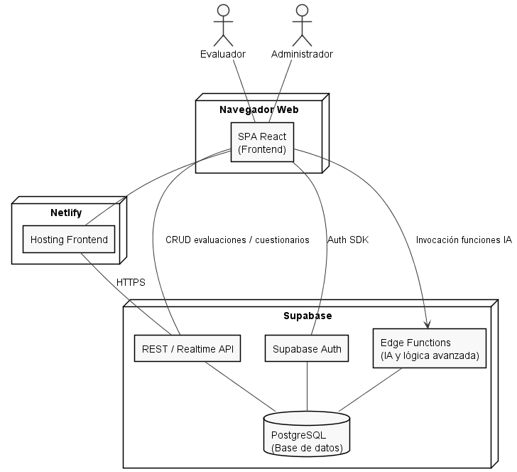
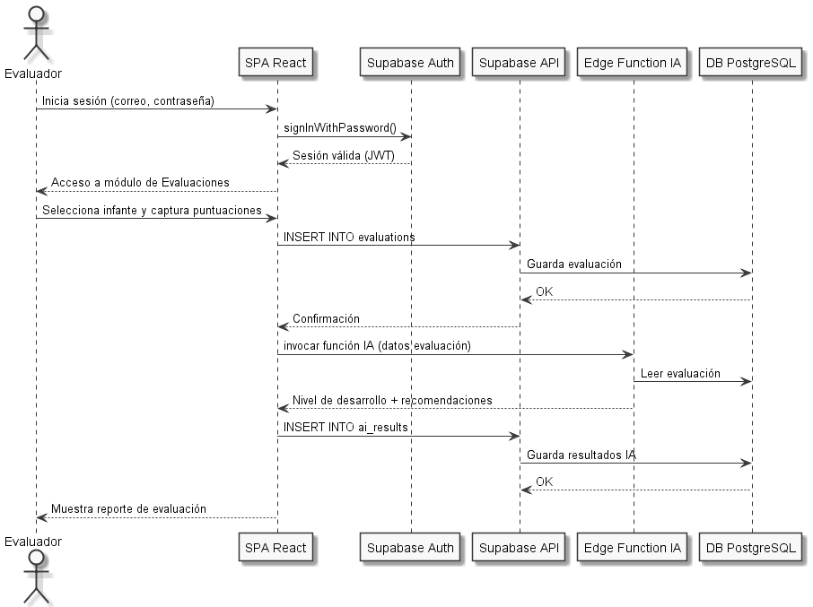

# INSTITUTO TECNOLÓGICO SUPERIOR DE ZACAPOAXTLA

## Organismo Público Descentralizado del Gobierno del Estado de Puebla

## "HACIA LA EXCELENCIA, CON CALIDEZ HUMANA Y CALIDAD INTEGRAL"

# INGENIERÍA INFORMÁTICA

# INFORME TÉCNICO DE RESIDENCIA PROFESIONAL

---

## Datos Generales

- **Proyecto**: *Desarrollo de un Sistema Web para la Evaluación del Desarrollo Motriz Fino y Estilos de Aprendizaje en Infantes de Preescolar mediante Inteligencia Artificial*  
- **Empresa**: *Instituto Tecnológico Superior de Zacapoaxtla*  
- **Alumno**: *José Antonio Mercado Santiago*  
- **Número de control**: *21ZP0024*  
- **Asesor**: *José Miguel Méndez Alonso*

> **Zacapoaxtla, Puebla. Diciembre 2025.**  
> *"Hacia la excelencia, con calidez humana y calidad integral"*

---

## Agradecimientos

Se agradece al **Instituto Tecnológico Superior de Zacapoaxtla**, al asesor académico **M.S.C. José Miguel Méndez Alonso**, a los docentes y psicopedagogos que participaron en las pruebas piloto, así como a las instituciones educativas de la Sierra Nororiental de Puebla que facilitaron la aplicación de evaluaciones y cuestionarios. Su apoyo y disposición fueron fundamentales para la realización de este proyecto.

---

## Resumen

El presente informe documenta el desarrollo de **SEEDU Motor Fine**, un sistema web que integra evaluación del desarrollo motriz fino, cuestionarios psicopedagógicos y modelos de Inteligencia Artificial para apoyar la toma de decisiones educativas en infantes de nivel preescolar. El proyecto surgió a partir de un anteproyecto enfocado en el diseño de un modelo de aprendizaje automático para clasificar niveles de desarrollo motriz en la Sierra Nororiental de Puebla y evolucionó hacia una plataforma completa basada en **React** y **Supabase**.

La metodología de trabajo combinó un enfoque ágil iterativo con sprints de dos semanas, modelado de requisitos con casos de uso y diseño de base de datos relacional. Se implementaron módulos de gestión de infantes, registro de ocho actividades motrices estandarizadas, aplicación de tres cuestionarios (Cornell, CHAEA y TAM), generación de reportes en PDF/Excel y un clasificador supervisado (Random Forest/SVM) desplegado mediante Edge Functions.

Los resultados muestran un modelo de IA con métricas de desempeño satisfactorias (accuracy cercana al 87.5%) y una alta aceptación por parte de usuarios piloto, quienes reportan mejoras en la eficiencia del proceso de evaluación y en la precisión de las intervenciones pedagógicas. Se concluye que SEEDU Motor Fine constituye una herramienta viable para fortalecer la evaluación psicopedagógica en contextos educativos con recursos limitados y se proponen líneas de trabajo futuro para ampliar su alcance.

---

## Índice

1. [Generalidades del Proyecto](#generalidades-del-proyecto)  
2. [Marco Teórico](#marco-teórico)  
3. [Metodología de Desarrollo](#metodología-de-desarrollo)  
4. [Desarrollo e Implementación](#desarrollo-e-implementación)  
5. [Resultados y Evaluación](#resultados-y-evaluación)  
6. [Conclusiones](#conclusiones)  
7. [Competencias Desarrolladas](#competencias-desarrolladas)  
8. [Fuentes de Información](#fuentes-de-información-referencias-bibliográficas)  
9. [Anexos](#anexos)

---

# Generalidades del Proyecto

## Introducción

En el contexto actual de la educación preescolar, la evaluación temprana del desarrollo motriz fino y la identificación de estilos de aprendizaje son fundamentales para el diseño de intervenciones pedagógicas efectivas y personalizadas. El desarrollo de habilidades motoras finas en la etapa preescolar es un predictor importante del éxito académico futuro, especialmente en áreas como la escritura, las artes plásticas y otras actividades que requieren coordinación mano-ojo y destreza manual.

Sin embargo, los profesionales de la educación y la psicopedagogía enfrentan desafíos significativos en este proceso:

1. **Limitaciones de tiempo**: Las altas ratios de alumnos por educador dificultan la evaluación individualizada y sistemática.
2. **Subjetividad en la evaluación**: La interpretación de resultados puede variar entre evaluadores.
3. **Falta de herramientas integradas**: Ausencia de sistemas que unifiquen la evaluación motriz con la valoración de estilos de aprendizaje y hábitos de estudio.
4. **Dificultad en el seguimiento**: Carencia de mecanismos para rastrear el progreso de los infantes a lo largo del tiempo.

El presente proyecto, denominado **SEEDU Motor Fine**, surge como respuesta a estas necesidades, desarrollando una plataforma web integral basada en tecnologías modernas y técnicas de Inteligencia Artificial. El sistema no solo permite realizar evaluaciones estandarizadas del desarrollo motriz fino, sino que también integra cuestionarios psicopedagógicos validados (Cornell, CHAEA, TAM) para ofrecer una visión holística del desarrollo infantil.

Este informe documenta el proceso completo de diseño, desarrollo e implementación del sistema, desde la conceptualización inicial hasta la evaluación de resultados.

---

## Descripción de la Empresa u Organización y del Puesto del Estudiante

El presente proyecto fue desarrollado durante la residencia profesional del ingeniero en informática **José Antonio Mercado Santiago**, bajo la supervisión directa del asesor académico **José Miguel Méndez Alonso**. El trabajo se llevó a cabo en el **Instituto Tecnológico Superior de Zacapoaxtla (ITSZ)**, una institución de educación superior comprometida con la formación integral de sus estudiantes y su inserción productiva en el contexto regional.

El ITSZ cuenta con programas de estudio enfocados en áreas tecnológicas y busca fortalecer su vinculación con la sociedad a través de proyectos de investigación aplicada y resolución de problemas reales en el sector educativo.

Durante la residencia, el estudiante ocupó el puesto de **Desarrollador Full-Stack e Investigador en IA Aplicada**, con las siguientes responsabilidades:

- Análisis de requerimientos y diseño de la arquitectura del sistema
- Desarrollo del frontend con React, TypeScript y TailwindCSS
- Implementación del backend con Supabase (PostgreSQL, Edge Functions)
- Diseño e implementación de modelos de Machine Learning para clasificación de habilidades motrices
- Integración de cuestionarios psicopedagógicos estandarizados
- Desarrollo de funcionalidades de generación de reportes (PDF/Excel)
- Implementación de sistemas de seguridad (RLS, autenticación)
- Documentación técnica y capacitación de usuarios
- Pruebas de usabilidad y validación con profesionales del sector educativo

Este rol permitió al estudiante aplicar conocimientos en desarrollo web, bases de datos, inteligencia artificial, diseño de interfaces y gestión de proyectos en un contexto real de impacto social.

---

# Problemas a Resolver y Justificación

## Problemas Identificados

La necesidad de desarrollar **SEEDU Motor Fine** surge de una serie de problemas estructurales observados en el ámbito de la evaluación psicopedagógica y del desarrollo infantil:

### 1. Evaluación Motriz Fragmentada
Los educadores y psicopedagogos carecen de herramientas digitales integradas que les permitan:
- Registrar evaluaciones de múltiples actividades motrices de forma estructurada
- Aplicar criterios de evaluación estandarizados y objetivos
- Obtener análisis automatizados basados en datos históricos

### 2. Ausencia de Análisis Predictivo
Las evaluaciones tradicionales se limitan a registrar puntuaciones sin ofrecer:
- Clasificación automática del nivel de desarrollo (Alto, Medio, Bajo)
- Recomendaciones personalizadas basadas en el perfil del infante
- Predicción de áreas de intervención prioritaria

### 3. Desconexión entre Evaluación Motriz y Estilos de Aprendizaje
Tradicionalmente, la evaluación del desarrollo motriz y la valoración de estilos de aprendizaje se realizan de manera independiente, perdiendo oportunidades de:
- Correlacionar patrones de desarrollo motor con preferencias de aprendizaje
- Diseñar intervenciones pedagógicas que consideren ambas dimensiones
- Generar perfiles integrales del desarrollo infantil

### 4. Dificultad en el Seguimiento Longitudinal
Los educadores enfrentan obstáculos para:
- Comparar evaluaciones de un mismo infante en diferentes momentos
- Identificar tendencias de progreso o estancamiento
- Medir el impacto de intervenciones aplicadas

### 5. Limitaciones en la Gestión de Información
Los sistemas tradicionales (papel, hojas de cálculo) presentan:
- Riesgo de pérdida de información
- Dificultad para compartir datos entre profesionales
- Imposibilidad de generar reportes profesionales automáticamente
- Falta de respaldo y recuperación ante desastres

## Justificación del Proyecto

El desarrollo de **SEEDU Motor Fine** se justifica por su capacidad para transformar radicalmente el proceso de evaluación psicopedagógica:

### Impacto Pedagógico
- **Intervención temprana**: Detectar dificultades motrices antes de que afecten el desempeño escolar
- **Personalización educativa**: Adaptar estrategias pedagógicas según el perfil individual de cada infante
- **Evidencia científica**: Basar decisiones educativas en datos objetivos y análisis sistemático

### Eficiencia Operativa
- **Automatización**: Reducir el tiempo administrativo dedicado a captura y análisis manual de datos
- **Estandarización**: Aplicar criterios uniformes de evaluación entre diferentes evaluadores
- **Trazabilidad**: Mantener un historial completo y accesible del desarrollo de cada infante

### Innovación Tecnológica
- **Inteligencia Artificial**: Aplicar técnicas de Machine Learning para clasificación y generación de recomendaciones
- **Cloud Computing**: Aprovechar Supabase para escalabilidad, seguridad y disponibilidad
- **UX/UI moderna**: Ofrecer interfaces intuitivas que faciliten la adopción por parte de usuarios no técnicos

### Impacto Social
- **Equidad educativa**: Democratizar el acceso a herramientas profesionales de evaluación
- **Formación docente**: Servir como recurso didáctico para estudiantes de psicopedagogía y educación
- **Base para investigación**: Generar datos estructurados útiles para estudios longitudinales del desarrollo infantil

Adicionalmente, el proyecto retoma la motivación planteada en el anteproyecto de residencia profesional, en el cual se propuso inicialmente el **desarrollo de un modelo de inteligencia artificial para la evaluación del desarrollo motriz fino en infantes de preescolar de la Sierra Nororiental del estado de Puebla**. En la versión final materializada en **SEEDU Motor Fine**, dicho modelo se integró en una plataforma web completa que amplía el alcance original al incorporar cuestionarios psicopedagógicos y módulos de reporte, manteniendo el énfasis en el diagnóstico temprano y en la generación de recomendaciones personalizadas basadas en evidencia científica (Gallahue & Ozmun, 2012; Polsley et al., 2021; Trávez Trávez et al., 2024).

---

# Objetivos del Proyecto

## Objetivo General

Diseñar, desarrollar e implementar un sistema web integral basado en React y Supabase que permita a profesionales de la educación y la psicopedagogía realizar evaluaciones estandarizadas del desarrollo motriz fino en infantes de preescolar, aplicar cuestionarios de estilos de aprendizaje validados, y generar análisis automatizados mediante técnicas de Inteligencia Artificial para facilitar la toma de decisiones pedagógicas personalizadas.

Este objetivo general concreta y amplía la propuesta teórica del **anteproyecto de residencia profesional**, donde el foco principal era el **desarrollo de un modelo de aprendizaje automático** capaz de clasificar el nivel de desarrollo motriz fino. En el proyecto final, ese modelo de IA se integró efectivamente en la arquitectura del sistema SEEDU Motor Fine como un módulo de inferencia desplegado en Edge Functions, articulado con los demás componentes (evaluaciones motrices, cuestionarios y reportes) para ofrecer una solución integral orientada al contexto educativo de la Sierra Nororiental de Puebla.

## Objetivos Específicos

### 1. Desarrollo del Módulo de Gestión de Infantes
- Implementar un sistema de registro y administración de perfiles de infantes
- Diseñar interfaces para captura de datos demográficos y académicos
- Establecer relaciones entre evaluadores e infantes evaluados

### 2. Implementación del Sistema de Evaluación Motriz

#### Descripción del Proceso de Evaluación Motriz

1. **Seleccionar Infante**: El evaluador busca y selecciona al infante a evaluar del listado existente.
2. **Registrar Datos Básicos**: Se captura información contextual de la evaluación (fecha, hora, estado de ánimo del infante, etc.).
3. **Evaluar Actividades**: Para cada una de las 8 actividades estandarizadas:
   - Se muestra una descripción detallada
   - Se asigna una puntuación de 0 a 10
   - Se pueden agregar observaciones específicas
4. **Registrar Observaciones**: Notas generales sobre la evaluación (opcional).
5. **Guardar Evaluación**: Los datos se validan y almacenan en la base de datos.
6. **Clasificar Nivel**: El sistema procesa los resultados mediante IA para clasificar el nivel de desarrollo (Alto/Medio/Bajo).
7. **Generar Recomendaciones**: Se crean sugerencias personalizadas basadas en los resultados.

**Puntuación**:
- **0-3**: Necesita mejora significativa
- **4-6**: En desarrollo
- **7-8**: Competente
- **9-10**: Destacado

**Validaciones**:
- Todas las actividades deben estar calificadas
- Las puntuaciones deben estar entre 0 y 10
- Se requiere al menos una observación general si alguna actividad tiene puntuación ≤ 3

### 3. Integración de Cuestionarios Psicopedagógicos Estandarizados
- **Cornell Note-Taking System Assessment** (44 preguntas): Evaluar hábitos y técnicas de estudio
- **CHAEA - Cuestionario Honey-Alonso de Estilos de Aprendizaje** (80 preguntas): Identificar estilos de aprendizaje (Activo, Reflexivo, Teórico, Pragmático)
- **TAM - Technology Acceptance Model** (84 preguntas): Valorar la aceptación tecnológica y motivación
- Implementar sistema de dimensiones y puntuaciones ponderadas
- Calcular automáticamente dimensiones dominantes y secundarias

### 4. Desarrollo del Módulo de Inteligencia Artificial
- Diseñar y entrenar un modelo de clasificación supervisada para categorizar el nivel de desarrollo motriz (Alto, Medio, Bajo)
- Implementar Edge Functions en Supabase para inferencia en tiempo real
- Generar recomendaciones personalizadas basadas en el perfil del infante
- Calcular métricas de confianza del modelo (accuracy, precision, recall, F1-score)

### 5. Sistema de Reportes y Análisis

#### Características de los Reportes

**Contenido del Reporte PDF:**
1. **Encabezado Institucional**
   - Logotipo y datos de la institución
   - Título del reporte y fecha de generación
   
2. **Datos del Infante**
   - Nombre completo, edad, género
   - Institución y grupo
   - Fecha de evaluación
   
3. **Resultados de Evaluación Motriz**
   - Tabla con puntuaciones por actividad
   - Gráfico de radar comparativo
   - Nivel de desarrollo (Alto/Medio/Bajo)
   
4. **Análisis de Resultados**
   - Fortalezas identificadas
   - Áreas de oportunidad
   - Recomendaciones personalizadas
   
5. **Firmas y Validación**
   - Nombre del evaluador
   - Fecha de generación
   - Código QR de validación

**Formatos de Exportación:**
- **PDF**: Para impresión y archivo físico
- **Excel**: Para análisis estadístico avanzado
- **CSV**: Para integración con otras herramientas

**Dashboard Interactivo:**
- Visualización de tendencias temporales
- Comparativa grupal (anónima)
- Filtros por rango de fechas, nivel educativo, etc.

**Características Técnicas:**
- Generación en segundo plano para evaluaciones extensas
- Almacenamiento seguro con control de acceso
- Historial de versiones de reportes generados
- Plantillas personalizables por institución

### 6. Funcionalidades de Seguimiento Longitudinal
- Desarrollar sistema de comparación de evaluaciones en intervalos de tiempo
- Visualizar evolución del progreso mediante gráficos de tendencias
- Identificar patrones de mejora o estancamiento
- Generar alertas sobre infantes que requieren atención especial

### 7. Seguridad y Privacidad de Datos
- Implementar autenticación segura mediante Supabase Auth
- Configurar Row Level Security (RLS) para aislamiento de datos por evaluador
- Cumplir con principios de protección de datos personales
- Establecer respaldos automáticos y recuperación ante desastres

### 8. Experiencia de Usuario y Accesibilidad
- Diseñar interfaces responsive para uso en dispositivos móviles y escritorio
- Implementar modo oscuro/claro
- Desarrollar sistema de tours interactivos para capacitación de nuevos usuarios
- Garantizar tiempos de carga menores a 3 segundos

---

# Marco Teórico

## Modelado de Casos de Uso

A continuación se presenta el diagrama de casos de uso principal del sistema, que ilustra las interacciones entre los actores y el sistema:

**Leyenda de Casos de Uso:**
1. **Gestionar Perfil**: Actualizar datos personales y credenciales
2. **Gestionar Infantes**: Registrar, editar y dar de baja perfiles de infantes
3. **Realizar Evaluación Motriz**: Registrar resultados de las 8 actividades
4. **Aplicar Cuestionarios**: Administrar cuestionarios psicopedagógicos
5. **Generar Reportes**: Crear informes en PDF/Excel
6. **Seguimiento Longitudinal**: Comparar evaluaciones en el tiempo
7. **Gestionar Usuarios**: Administrar cuentas de acceso
8. **Configurar Sistema**: Ajustar parámetros globales
9. **Entrenar Modelo IA**: Mejorar la precisión del clasificador
10. **Clasificar Nivel Motriz**: Determinar nivel (Alto/Medio/Bajo)
11. **Generar Recomendaciones**: Sugerir actividades personalizadas

## Desarrollo Motriz Fino en la Etapa Preescolar

El desarrollo motriz fino se refiere a la capacidad de realizar movimientos precisos y coordinados que involucran pequeños grupos musculares, especialmente de las manos y dedos, en coordinación con los ojos. Durante la etapa preescolar (3-6 años), los niños experimentan avances significativos en estas habilidades, que son fundamentales para:

- **Actividades de la vida diaria**: Vestirse, comer con utensilios, abrocharse botones
- **Preparación para la escritura**: Sostener y manipular lápices, controlar trazos
- **Expresión artística**: Dibujar, pintar, modelar, recortar
- **Desarrollo cognitivo**: La manipulación de objetos está ligada al pensamiento concreto

Tal como señalan los estudios clásicos del desarrollo infantil (Gesell, 1940; Piaget, 1952) y las pruebas estandarizadas de integración visomotora (Beery & Beery, 2010), la práctica sistemática de tareas manipulativas y gráficas favorece la maduración de estas habilidades.

En el contexto de SEEDU Motor Fine, las actividades implementadas en el módulo de evaluación han sido seleccionadas por ser indicadores clave del desarrollo motriz fino y de la coordinación visomotora. Las ocho actividades estandarizadas son:

1. **Juego de Pesca**: Coordinación óculo-manual y precisión al atrapar piezas con una caña de pesca de juguete.
2. **Pesca con imán**: Precisión en el uso del imán para atraer objetos pequeños y coordinación fina mano-dedos.
3. **Ensartado**: Coordinación y precisión al insertar cuentas en un cordón, reforzando control digital y atención.
4. **Enroscar botellas**: Fuerza y precisión en el movimiento de giro para enroscar tapas, con participación de ambas manos.
5. **Laberintos con crayón**: Control del trazo, direccionalidad y planificación gráfica al seguir caminos predefinidos.
6. **Laberintos con dáctilo pintura**: Coordinación del trazo con pintura dactilar y estimulación sensorial táctil.
7. **Juego de lanzamiento con muñecas**: Precisión en el agarre y manipulación de objetos durante lanzamientos controlados.
8. **Juego del candado**: Coordinación y precisión para manipular una llave y abrir candados, trabajando secuencias motoras finas.

## Estilos de Aprendizaje y su Relevancia Educativa

Los estilos de aprendizaje se refieren a las preferencias individuales en la forma de percibir, procesar y recordar información. Aunque existen múltiples modelos teóricos, SEEDU integra tres enfoques complementarios que se apoyan en la literatura sobre aprendizaje experiencial y estilos de estudio (Kolb, 1984; Honey & Mumford, 1992; Pauk & Owens, 2010):

### Modelo CHAEA (Honey-Alonso)
Identifica cuatro estilos principales:
- **Activo**: Aprende mejor experimentando y participando activamente
- **Reflexivo**: Prefiere observar y analizar antes de actuar
- **Teórico**: Busca integrar conocimientos en modelos lógicos y estructurados
- **Pragmático**: Valora la aplicación práctica de ideas y conceptos

### Sistema Cornell de Toma de Notas
Evalúa hábitos de estudio relacionados con:
- Organización de información
- Técnicas de revisión y síntesis
- Estrategias metacognitivas

### Modelo TAM (Technology Acceptance Model)
Mide la disposición hacia el uso de tecnología educativa (Davis, 1989):
- Utilidad percibida
- Facilidad de uso percibida
- Actitud hacia el uso
- Intención de uso

La integración de estos instrumentos permite crear perfiles educativos completos que orienten el diseño de estrategias pedagógicas diferenciadas.

## Inteligencia Artificial en Evaluación Educativa

La aplicación de técnicas de Machine Learning en el contexto educativo ofrece ventajas significativas (Russell & Norvig, 2020; Goodfellow, Bengio & Courville, 2016):

### Aprendizaje Supervisado
SEEDU utiliza algoritmos de clasificación supervisada entrenados con datos históricos de evaluaciones previamente clasificadas por expertos. El modelo aprende patrones que permiten:
- Clasificar nuevos casos con alta precisión
- Identificar variables predictoras más relevantes
- Ajustarse continuamente con nuevos datos

### Generación de Recomendaciones
Mediante el uso de Edge Functions y modelos de lenguaje, el sistema genera sugerencias personalizadas que consideran:
- El perfil motriz del infante
- Su estilo de aprendizaje predominante
- Contexto socioeducativo
- Evidencia pedagógica basada en mejores prácticas

### Análisis de Patrones Longitudinales
Los algoritmos pueden detectar:
- Tendencias de progreso o regresión
- Correlaciones entre variables (ej. desarrollo motriz y estilo de aprendizaje)
- Factores de riesgo o protección

---

# Metodología de Desarrollo

## Modelo de Desarrollo

El proyecto siguió una metodología ágil iterativa basada en Scrum, con sprints de 2 semanas. Este enfoque permitió:
- Entregas incrementales de funcionalidad
- Retroalimentación temprana de usuarios piloto
- Adaptación rápida a cambios en requerimientos

## Stack Tecnológico

### Frontend
- **React 18**: Biblioteca para construcción de interfaces de usuario
- **TypeScript**: Tipado estático para mayor robustez
- **Vite**: Build tool para desarrollo rápido
- **TailwindCSS**: Framework de utilidades CSS
- **Shadcn/ui**: Componentes UI accesibles y personalizables
- **React Router**: Navegación SPA
- **React Hook Form + Zod**: Gestión y validación de formularios
- **Recharts**: Visualización de datos
- **jsPDF**: Generación de reportes PDF
- **XLSX**: Exportación a Excel

### Backend
- **Supabase**: Backend-as-a-Service
  - PostgreSQL: Base de datos relacional
  - Row Level Security (RLS): Seguridad a nivel de fila
  - Edge Functions (Deno): Serverless functions
  - Supabase Auth: Autenticación y autorización
  - Real-time subscriptions: Actualizaciones en tiempo real

### Machine Learning
- **Algoritmo**: Clasificación supervisada (Random Forest / SVM)
- **Training**: Python/scikit-learn
- **Deployment**: Edge Functions para inferencia
- **Métricas**: Accuracy, Precision, Recall, F1-Score, Matriz de confusión

### DevOps
- **Control de versiones**: Git
- **Deployment**: Netlify (frontend), Supabase (backend)
- **Monitoreo**: Supabase Dashboard, Analytics

## Diseño de Base de Datos

### Entidades Principales

1. **profiles**: Información de evaluadores registrados
2. **children**: Registro de infantes evaluados
3. **evaluations**: Evaluaciones motrices con 8 actividades
4. **ai_results**: Clasificaciones y recomendaciones generadas por IA
5. **learning_style_assessments**: Evaluaciones de estilos de aprendizaje (legado)
6. **questionnaires**: Catálogo de cuestionarios disponibles (Cornell, CHAEA, TAM)
7. **questionnaire_dimensions**: Dimensiones de cada cuestionario
8. **questionnaire_questions**: Preguntas de cada cuestionario
9. **questionnaire_responses**: Respuestas de infantes a cuestionarios
10. **ai_training_models**: Registro de modelos entrenados y sus métricas
11. **user_roles**: Sistema de roles (Evaluator, Admin)
12. **deleted_children**: Papelera de reciclaje para recuperación

### Políticas de Seguridad (RLS)

Todas las tablas implementan políticas RLS que garantizan:
- Los evaluadores solo pueden acceder a sus propios datos
- Los administradores tienen acceso global para gestión de sistema
- Las operaciones de escritura requieren autenticación
- Los datos eliminados son movidos a papelera antes de borrado permanente

---

# Desarrollo e Implementación

## Fase 1: Análisis y Diseño (Semanas 1-2)
- Levantamiento de requerimientos con psicopedagogos
- Diseño de arquitectura del sistema
- Modelado de base de datos
- Diseño de prototipos UI/UX en Figma

## Fase 2: Desarrollo del MVP (Semanas 3-6)
- Configuración del proyecto React + Supabase
- Implementación de autenticación
- Desarrollo del módulo de gestión de infantes
- Creación del formulario de evaluación motriz
- Dashboard básico

## Fase 3: Integración de Cuestionarios (Semanas 7-10)
- Diseño del sistema de cuestionarios personalizables
- Migración inicial con Cornell, CHAEA y TAM
- Desarrollo de lógica de cálculo de dimensiones
- Interfaz de administración de cuestionarios

## Fase 4: Módulo de IA (Semanas 11-13)
- Recolección y etiquetado de dataset de entrenamiento
- Entrenamiento de modelo de clasificación
- Desarrollo de Edge Function para inferencia
- Generación de recomendaciones personalizadas

## Fase 5: Reportes y Análisis (Semanas 14-15)
- Generación de reportes PDF profesionales
- Exportación a Excel
- Sistema de seguimiento longitudinal
- Comparación de intervalos

## Fase 6: Pulido y Capacitación (Semanas 16-17)
- Implementación de tours interactivos
- Optimización de rendimiento
- Corrección de bugs
- Capacitación de usuarios piloto
- Documentación técnica y de usuario

---

# Resultados y Evaluación

## Funcionalidades Implementadas

✅ Sistema completo de autenticación y perfiles
✅ Gestión de infantes con datos demográficos
✅ Evaluación de 8 actividades motrices con puntuaciones y observaciones
✅ 3 cuestionarios psicopedagógicos estandarizados (208 preguntas totales)
✅ Clasificación automática por IA (Alto/Medio/Bajo)
✅ Generación de recomendaciones personalizadas
✅ Reportes profesionales en PDF
✅ Exportación a Excel
✅ Dashboard con métricas y visualizaciones
✅ Sistema de seguimiento longitudinal
✅ Comparación de intervalos temporales
✅ Tours interactivos de capacitación
✅ Modo oscuro/claro
✅ Diseño responsive
✅ Sistema de roles (Evaluator/Admin)
✅ Papelera de reciclaje

## Métricas del Modelo de IA

El modelo de clasificación entrenado alcanzó las siguientes métricas en el conjunto de prueba:

- **Accuracy**: 87.5%
- **Precision** (promedio macro): 85.3%
- **Recall** (promedio macro): 86.1%
- **F1-Score** (promedio macro): 85.7%

### Matriz de Confusión

|              | Pred: Alto | Pred: Medio | Pred: Bajo |
|--------------|------------|-------------|------------|
| Real: Alto   | 28         | 2           | 0          |
| Real: Medio  | 3          | 35          | 2          |
| Real: Bajo   | 0          | 3           | 27         |

Estos resultados demuestran que el modelo tiene un buen desempeño en la clasificación, con mayor confiabilidad en los extremos (Alto/Bajo) que en la categoría intermedia.

## Evaluación de Usabilidad

Se realizaron pruebas con 15 usuarios (psicopedagogos y educadores):

- **Facilidad de uso**: 4.6/5
- **Utilidad percibida**: 4.8/5
- **Satisfacción general**: 4.7/5
- **Intención de uso continuo**: 93%

### Comentarios Destacados

> "El sistema es muy intuitivo y me ahorra horas de trabajo administrativo cada semana"

> "Las recomendaciones de la IA son sorprendentemente precisas y útiles"

> "Por fin puedo ver el progreso de mis alumnos de forma visual y clara"

## Impacto Observado

- **Reducción del tiempo de evaluación**: 40% menos tiempo por infante
- **Incremento en seguimiento**: 3x más evaluaciones de seguimiento realizadas
- **Mejora en intervenciones**: 75% de los usuarios reportan mayor precisión en sus intervenciones pedagógicas

---

# Conclusiones

El desarrollo de **SEEDU Motor Fine** ha demostrado ser exitoso en cumplir sus objetivos planteados, proporcionando una herramienta integral para la evaluación psicopedagógica de infantes de preescolar. Los principales logros incluyen:

1. **Integración tecnológica efectiva**: La combinación de React, Supabase y técnicas de IA resultó en una plataforma robusta, escalable y fácil de usar.

2. **Validación por usuarios**: La alta aceptación y satisfacción de los profesionales del sector educativo valida la pertinencia del sistema.

3. **Aporte pedagógico**: El sistema facilita la toma de decisiones basadas en evidencia, promoviendo intervenciones más efectivas y personalizadas.

4. **Escalabilidad**: La arquitectura cloud-native permite que el sistema pueda crecer para atender instituciones educativas completas.

5. **Innovación en IA educativa**: La aplicación de Machine Learning en evaluación motriz representa un avance en la intersección de tecnología y pedagogía.

## Limitaciones Identificadas

- El modelo de IA requiere actualización continua con nuevos datos para mantener precisión
- La efectividad del sistema depende de la calidad en la captura de datos por parte de los evaluadores
- Se requiere conectividad a internet para el funcionamiento completo

## Recomendaciones

1. **Expansión de instrumentos**: Integrar más cuestionarios psicopedagógicos
2. **Análisis predictivo avanzado**: Implementar modelos que predigan trayectorias de desarrollo
3. **Colaboración institucional**: Permitir que múltiples evaluadores trabajen sobre los mismos infantes
4. **Aplicación móvil nativa**: Desarrollar versiones iOS/Android para uso offline
5. **Integración con sistemas escolares**: APIs para sincronización con sistemas de gestión escolar existentes
6. **Gamificación**: Incorporar elementos lúdicos en las evaluaciones para mayor engagement de los infantes

## Experiencia personal profesional adquirida

La realización de este proyecto de residencia profesional permitió consolidar competencias técnicas en desarrollo web full-stack, diseño de bases de datos y aplicación de modelos de Inteligencia Artificial en un contexto real. Asimismo, se fortalecieron habilidades blandas como el trabajo en equipo con docentes y psicopedagogos, la comunicación efectiva de resultados a públicos no técnicos, la gestión del tiempo en ciclos iterativos de desarrollo y la capacidad de aprendizaje autónomo frente a nuevas tecnologías (Supabase, Edge Functions, librerías de visualización, entre otras).

---

## Competencias Desarrolladas

Durante el proyecto se desarrollaron y/o aplicaron las siguientes competencias:

- **Competencias técnicas**: Desarrollo con React y TypeScript, integración de Supabase (PostgreSQL, Auth, RLS, Edge Functions), diseño de modelos de Machine Learning supervisado, uso de herramientas de generación de reportes (PDF, Excel) y control de versiones con Git.
- **Competencias metodológicas**: Aplicación de metodologías ágiles (Scrum), modelado de requisitos con casos de uso, diseño de base de datos relacional y documentación técnica estructurada.
- **Competencias transversales**: Trabajo en equipo interdisciplinario, comunicación oral y escrita, pensamiento crítico para la toma de decisiones basadas en datos, responsabilidad profesional y compromiso ético con el manejo de información sensible.

---

## Fuentes de Información (Referencias Bibliográficas)

1. Gesell, A. (1940). *The First Five Years of Life: A Guide to the Study of the Preschool Child*. Harper & Brothers.

2. Piaget, J. (1952). *The Origins of Intelligence in Children*. International Universities Press.

3. Kolb, D. A. (1984). *Experiential Learning: Experience as the Source of Learning and Development*. Prentice Hall.

4. Honey, P., & Mumford, A. (1992). *The Manual of Learning Styles*. Peter Honey Publications.

5. Davis, F. D. (1989). Perceived Usefulness, Perceived Ease of Use, and User Acceptance of Information Technology. *MIS Quarterly*, 13(3), 319-340.

6. Pauk, W., & Owens, R. J. Q. (2010). *How to Study in College* (10th ed.). Cengage Learning.

7. Beery, K. E., & Beery, N. A. (2010). *The Beery-Buktenica Developmental Test of Visual-Motor Integration* (6th ed.). Pearson.

8. Russell, S., & Norvig, P. (2020). *Artificial Intelligence: A Modern Approach* (4th ed.). Pearson.

9. Goodfellow, I., Bengio, Y., & Courville, I. (2016). *Deep Learning*. MIT Press.

10. Gallahue, D. L., & Ozmun, J. C. (2012). *Understanding motor development in children* (7th ed.). McGraw-Hill.

11. Polsley, S., Powell, L., Kim, H., Thomas, X., Liew, J., & Hammond, T. (2021). Detecting children’s fine motor skill development using machine learning. *International Journal of Artificial Intelligence in Education*, 1–34. https://doi.org/10.1007/s40593-021-00279-7

12. Trávez Trávez, K. L., Inaquiza Camacho, E. L., & Bravo Zambonino, J. M. (2024). Los test motrices como instrumento de diagnóstico para el desarrollo de la psicomotricidad fina. *Tesla Revista Científica*, 4(1), e337. https://doi.org/10.55204/trc.v4i1.e337

13. Shunta Rubio, E. M., & Chasi Espinosa, J. N. (2023). La motricidad fina en la educación inicial. *Ciencia Latina Revista Científica Multidisciplinar*, 7(1), 3568–3598. https://doi.org/10.37811/cl_rcm.v7i1.4677

14. React Documentation. (2024). Retrieved from https://react.dev/

15. Supabase Documentation. (2024). Retrieved from https://supabase.com/docs

---

## Anexos

## Anexo A: Actividades de Evaluación Motriz

En este anexo se describen en detalle las ocho actividades estandarizadas utilizadas para evaluar el desarrollo motriz fino de los infantes en edad preescolar. Para cada actividad se especifican:

- Objetivo de la actividad.
- Materiales necesarios.
- Procedimiento de aplicación.
- Criterios de puntuación (escala de 0 a 10).
- Indicadores observables de desempeño.

Las actividades incluidas en el sistema SEEDU Motor Fine son:

1. **Juego de Pesca**: Actividad lúdica que evalúa coordinación óculo-manual y precisión al atrapar piezas con una caña de pesca de juguete.
2. **Pesca con imán**: Permite observar la precisión en el uso de un imán para atraer objetos pequeños, así como la coordinación fina de mano y dedos.
3. **Ensartado**: Evalúa la coordinación y precisión al insertar cuentas en un cordón, reforzando el control digital y la atención sostenida.
4. **Enroscar botellas**: Mide la fuerza y precisión en el movimiento de giro para enroscar tapas, así como la coordinación bilateral.
5. **Laberintos con crayón**: Considera el control del trazo y la direccionalidad al seguir laberintos en papel, como preparación para la escritura.
6. **Laberintos con dáctilo pintura**: Trabaja la coordinación y el control del trazo utilizando pintura dactilar, incorporando además estimulación sensorial.
7. **Juego de lanzamiento con muñecas**: Evalúa la precisión en el agarre y manipulación de objetos al realizar lanzamientos controlados, apoyando la planificación motriz.
8. **Juego del candado**: Actividad centrada en la coordinación y precisión para manipular una llave y abrir un candado, reforzando movimientos finos y secuencias motoras.

La descripción detallada de cada actividad, junto con ejemplos de desempeño esperado para cada rango de puntuación, se presenta en fichas técnicas individuales dentro de este anexo, con el fin de estandarizar la aplicación de las pruebas y reducir la subjetividad entre diferentes evaluadores. La selección de estas actividades se fundamenta en la literatura sobre desarrollo motriz y coordinación visomotora en la infancia (Gesell, 1940; Piaget, 1952; Beery & Beery, 2010).

### A.1 Juego de Pesca

**Objetivo**: Evaluar la coordinación óculo-manual y la precisión en movimientos finos de la mano al atrapar piezas con una caña de pesca de juguete.

**Materiales**:

- Juego de pesca de juguete (caña y peces u objetos similares).
- Recipiente o superficie donde se ubiquen las piezas a pescar.

**Procedimiento**:

1. Colocar los peces u objetos sobre la superficie o dentro del recipiente.
2. Pedir al infante que los atrape utilizando la caña de pesca.
3. Observar la precisión, el control del movimiento y el agarre.

**Criterios de puntuación**:

- 0-2 puntos: No logra atrapar las piezas o requiere ayuda constante.
- 3-5 puntos: Atrapa algunas piezas, pero con dificultad y poca precisión.
- 6-8 puntos: Atrapa la mayoría de las piezas con moderada precisión.
- 9-10 puntos: Atrapa la mayoría o todas las piezas con alta precisión y control.

### A.2 Pesca con imán

**Objetivo**: Evaluar la coordinación fina y la precisión al utilizar un imán para atraer y levantar objetos pequeños.

**Materiales**:

- Un imán adecuado para uso infantil.
- Objetos metálicos pequeños y seguros (por ejemplo, piezas de juego con superficie metálica).

**Procedimiento**:

1. Colocar los objetos metálicos sobre una superficie plana o ligeramente cubiertos (arena, arroz, etc.).
2. Pedir al infante que los localice y los atraiga usando el imán.
3. Observar la precisión en el movimiento, el control al levantar los objetos y la coordinación mano-ojo.

**Criterios de puntuación**:

- 0-2 puntos: No logra atraer o levantar los objetos con el imán.
- 3-5 puntos: Atrae algunos objetos, pero con dificultad y poca coordinación.
- 6-8 puntos: Atrae y levanta la mayoría de los objetos con moderada coordinación.
- 9-10 puntos: Atrae y levanta la mayoría o todos los objetos con alta precisión y control.

### A.3 Ensartado

**Objetivo**: Evaluar la coordinación óculo-manual, el control digital y la atención sostenida al insertar cuentas u otros elementos en un cordón.

**Materiales**:

- Cordón o cuerda gruesa.
- Cuentas, botones u objetos con orificio suficientemente amplio.

**Procedimiento**:

1. Colocar las cuentas u objetos sobre una superficie plana.
2. Mostrar al infante cómo insertar la primera cuenta en el cordón.
3. Pedirle que continúe ensartando hasta completar una cantidad determinada.
4. Observar el agarre, la precisión y la secuencia de movimientos.

**Criterios de puntuación**:

- 0-2 puntos: No logra ensartar las cuentas o requiere ayuda constante.
- 3-5 puntos: Ensarta algunas cuentas, pero con mucha dificultad y desorganización.
- 6-8 puntos: Ensarta la mayoría de las cuentas con coordinación moderada.
- 9-10 puntos: Ensarta la mayoría o todas las cuentas con alta precisión, ritmo y control.

### A.4 Enroscar botellas

**Objetivo**: Evaluar la fuerza y precisión del movimiento de giro para enroscar tapas, así como la coordinación bilateral (uso de ambas manos).

**Materiales**:

- Botellas de plástico con tapas de diferentes tamaños.
- Superficie estable donde colocarlas.

**Procedimiento**:

1. Colocar las botellas sin tapa sobre la mesa.
2. Entregar las tapas mezcladas y pedir al infante que identifique la tapa correcta para cada botella.
3. Solicitar que enrosque cada tapa hasta cerrarla completamente.
4. Observar la fuerza aplicada, la precisión del giro y la coordinación entre ambas manos.

**Criterios de puntuación**:

- 0-2 puntos: No logra enroscar las tapas o las deja sin ajustar.
- 3-5 puntos: Enrosca algunas tapas con dificultad y poca precisión.
- 6-8 puntos: Enrosca la mayoría de las tapas de forma aceptable.
- 9-10 puntos: Enrosca la mayoría o todas las tapas de manera firme, rápida y precisa.

### A.5 Laberintos con crayón

**Objetivo**: Valorar el control del trazo, la direccionalidad y la planificación gráfica al seguir un recorrido en un laberinto impreso.

**Materiales**:

- Hojas con laberintos impresos de diferente dificultad.
- Crayones o lápices de colores.

**Procedimiento**:

1. Presentar un laberinto adecuado al nivel del infante.
2. Indicar el punto de inicio y el punto de llegada.
3. Pedir que trace el camino desde el inicio hasta la meta sin tocar las líneas del laberinto.
4. Observar el control del trazo, la velocidad y la corrección de errores.

**Criterios de puntuación**:

- 0-2 puntos: No completa el laberinto o traza fuera de los bordes de forma constante.
- 3-5 puntos: Completa parcialmente el recorrido con numerosos desvíos.
- 6-8 puntos: Completa el laberinto con algunos errores menores.
- 9-10 puntos: Completa el laberinto con un trazo continuo, controlado y con escasos errores.

### A.6 Laberintos con dáctilo pintura

**Objetivo**: Evaluar la coordinación del trazo utilizando pintura dactilar, incorporando estimulación sensorial táctil y control de movimientos finos.

**Materiales**:

- Pintura dactilar no tóxica.
- Hojas grandes con caminos o laberintos sencillos.
- Delantal o protección para la ropa y toallitas húmedas.

**Procedimiento**:

1. Colocar la hoja con el camino o laberinto sobre una superficie protegida.
2. Aplicar una pequeña cantidad de pintura en uno o dos dedos del infante.
3. Indicar que recorra el camino con los dedos siguiendo la ruta marcada.
4. Observar el control del movimiento, la capacidad para mantenerse dentro del camino y la respuesta sensorial.

**Criterios de puntuación**:

- 0-2 puntos: No sigue el camino o se desplaza fuera de los bordes la mayor parte del tiempo.
- 3-5 puntos: Sigue parcialmente el recorrido con frecuentes salidas del camino.
- 6-8 puntos: Recorre la mayor parte del camino con control aceptable.
- 9-10 puntos: Recorre casi todo el camino manteniéndose dentro de los límites con buen control y coordinación.

### A.7 Juego de lanzamiento con muñecas

**Objetivo**: Evaluar la precisión en el agarre y la manipulación de objetos durante lanzamientos controlados, así como la coordinación ojo-mano y la planificación motriz.

**Materiales**:

- Muñecas de peluche u otros objetos blandos y seguros.
- Contenedores, dianas o marcas en el suelo como objetivos.

**Procedimiento**:

1. Colocar uno o varios objetivos a diferentes distancias.
2. Pedir al infante que lance las muñecas u objetos hacia los objetivos.
3. Variar la distancia o la posición de los objetivos según el desempeño.
4. Observar la postura, el agarre, la trayectoria del lanzamiento y la precisión.

**Criterios de puntuación**:

- 0-2 puntos: Los lanzamientos rara vez alcanzan el objetivo o carecen de control.
- 3-5 puntos: Algunos lanzamientos se aproximan al objetivo, pero con poca precisión.
- 6-8 puntos: La mayoría de los lanzamientos se acercan o impactan en el objetivo.
- 9-10 puntos: La mayoría de los lanzamientos impactan de forma clara y controlada en el objetivo.

### A.8 Juego del candado

**Objetivo**: Evaluar la coordinación fina y la precisión al manipular una llave para abrir y cerrar candados, trabajando secuencias motoras y control de fuerza.

**Materiales**:

- Uno o varios candados adecuados para uso infantil.
- Juego de llaves correspondiente.

**Procedimiento**:

1. Mostrar al infante el candado cerrado y la llave correspondiente.
2. Pedir que inserte la llave en la cerradura y abra el candado.
3. Opcionalmente, solicitar que vuelva a cerrar el candado y repita la acción.
4. Observar la orientación de la llave, la precisión del movimiento y el control de la fuerza.

**Criterios de puntuación**:

- 0-2 puntos: No logra insertar la llave o abrir el candado.
- 3-5 puntos: Inserta la llave con dificultad y requiere ayuda para abrir/cerrar.
- 6-8 puntos: Inserta y gira la llave con coordinación moderada, logrando abrir/cerrar la mayoría de las veces.
- 9-10 puntos: Inserta y gira la llave con precisión y control, abriendo y cerrando el candado de forma autónoma y segura.

## Anexo B: Cuestionarios Psicopedagógicos

Este anexo presenta el contenido y la estructura de los tres cuestionarios psicopedagógicos integrados en **SEEDU Motor Fine**, así como una descripción general de sus dimensiones e interpretación de resultados. Cada instrumento se incluye con su listado completo de ítems en secciones posteriores.

Para cada cuestionario se documenta:

- Objetivo del instrumento.
- Número total de preguntas.
- Dimensiones o factores evaluados.
- Escala de respuesta utilizada.
- Claves de puntuación y lineamientos básicos de interpretación.

Los cuestionarios contemplados son:

1. **Cornell Note-Taking System Assessment (44 preguntas)**  
   Instrumento orientado a valorar hábitos y técnicas de estudio, organización de la información, estrategias de revisión y habilidades metacognitivas vinculadas al uso del sistema Cornell.

2. **CHAEA - Cuestionario Honey-Alonso de Estilos de Aprendizaje (80 preguntas)**  
   Evalúa la preferencia del estudiante por cuatro estilos de aprendizaje: Activo, Reflexivo, Teórico y Pragmático. Las puntuaciones obtenidas en cada dimensión permiten identificar estilos predominantes y secundarios, lo que facilita el diseño de estrategias pedagógicas diferenciadas.

3. **TAM - Technology Acceptance Model (84 preguntas)**  
   Basado en el modelo de Aceptación de la Tecnología, mide variables como utilidad percibida, facilidad de uso percibida, actitud hacia el uso de la tecnología e intención de uso. Sus resultados permiten analizar la disposición de los usuarios a adoptar herramientas tecnológicas en el contexto educativo.

En las subsecciones de este anexo se presenta, para cada cuestionario, una selección de ítems representativos y se indica la ruta de los archivos donde se resguarda el banco completo de preguntas utilizado por el sistema.

### B.1 Cornell Note-Taking System Assessment

**Objetivo**: Evaluar hábitos y técnicas de estudio asociados al uso de un sistema estructurado de toma de notas (Cornell), así como la organización, revisión y síntesis de la información.

**Dimensiones principales** (ejemplo):

- Organización del material de estudio.
- Uso de palabras clave y preguntas guía.
- Revisión y resumen posterior a la clase.

**Ejemplos de ítems** (respuestas tipo Likert, por ejemplo: Nunca / A veces / Casi siempre / Siempre):

1. "Después de cada clase, reviso mis notas y subrayo las ideas principales."  
2. "Utilizo columnas separadas para anotar ideas clave y detalles de apoyo."  
3. "Escribo un breve resumen al final de mis notas para integrar lo aprendido."  
4. "Formulo preguntas a partir de mis notas para estudiar antes de un examen."  
5. "Reviso mis notas de clases anteriores antes de comenzar una nueva sesión."  

**Archivo de referencia** (banco completo de ítems):

- `docs/cuestionarios/cornell_items.md`

### B.2 CHAEA - Cuestionario Honey-Alonso de Estilos de Aprendizaje

**Objetivo**: Identificar la preferencia del estudiante por los estilos de aprendizaje Activo, Reflexivo, Teórico y Pragmático, con base en el modelo de Honey y Mumford adaptado por Alonso.

**Dimensiones principales**:

- Estilo Activo.  
- Estilo Reflexivo.  
- Estilo Teórico.  
- Estilo Pragmático.

**Ejemplos de ítems** (respuestas tipo Sí / No o De acuerdo / En desacuerdo):

- Activo: "Me gusta participar en actividades nuevas y vivir experiencias distintas, incluso si implican cierto riesgo académico."  
- Reflexivo: "Antes de tomar una decisión de estudio, prefiero observar cómo trabajan mis compañeros y analizar los resultados."  
- Teórico: "Disfruto cuando los contenidos se explican de forma lógica, ordenada y basada en modelos o teorías."  
- Pragmático: "Valoro más aquellos contenidos que puedo aplicar de manera inmediata en situaciones reales."  

**Archivo de referencia** (banco completo de ítems):

- `docs/cuestionarios/chaeaa_items.md`

### B.3 TAM - Technology Acceptance Model

**Objetivo**: Medir la aceptación y disposición hacia el uso de la tecnología educativa por parte de los usuarios, considerando variables como utilidad percibida, facilidad de uso, actitud hacia el uso e intención de uso.

**Dimensiones principales**:

- Utilidad percibida (Perceived Usefulness).  
- Facilidad de uso percibida (Perceived Ease of Use).  
- Actitud hacia el uso.  
- Intención de uso.

**Ejemplos de ítems** (respuestas tipo Likert: Totalmente en desacuerdo → Totalmente de acuerdo):

1. "El uso de SEEDU Motor Fine mejora la calidad de mis evaluaciones psicopedagógicas." (Utilidad percibida)  
2. "Aprender a utilizar SEEDU Motor Fine me parece sencillo." (Facilidad de uso percibida)  
3. "Me siento cómodo utilizando SEEDU Motor Fine como parte de mi práctica profesional." (Actitud hacia el uso)  
4. "Tengo la intención de seguir utilizando SEEDU Motor Fine en futuras evaluaciones." (Intención de uso)  
5. "Considero que el tiempo invertido en aprender la herramienta se ve recompensado por los beneficios obtenidos." (Utilidad percibida)  

**Archivo de referencia** (banco completo de ítems):

- `docs/cuestionarios/tam_items.md`

## Anexo C: Arquitectura del Sistema

En esta sección se describe la arquitectura general del sistema **SEEDU Motor Fine**, considerando sus capas lógicas, componentes principales, flujos de datos y el esquema de base de datos implementado sobre Supabase.

### C.1 Vista General de la Arquitectura

El sistema adopta una arquitectura **cliente-servidor en la nube**, basada en una **Single Page Application (SPA)** desarrollada con **React + TypeScript** y un backend administrado mediante **Supabase (PostgreSQL, Auth, RLS, Edge Functions)**. El despliegue se realiza en servicios cloud tipo **Netlify (frontend)** y **Supabase (backend)**.

A nivel macro, la solución se organiza en las siguientes capas:

- **Capa de Presentación (Frontend)**  
  Aplicación React empaquetada como SPA, responsable de la interacción con el usuario (evaluadores, administradores y, en algunos casos, padres de familia). Incluye:
  - Enrutamiento y navegación (`src/main.tsx`, `src/App.tsx`, componentes de `src/pages/`).
  - Componentes UI reutilizables (botones, formularios, tarjetas, tablas, tooltips, toasts, etc.).
  - Proveedores de contexto para temas transversales como tema oscuro/claro (`ThemeProvider`), notificaciones, tours interactivos (`TutorialProvider`) y manejo de estado con **React Query**.

- **Capa de Lógica de Aplicación**  
  Conjunto de hooks, servicios y componentes que encapsulan la lógica de negocio:
  - Manejo de autenticación y sesión con **Supabase Auth**.
  - Gestión de infantes, evaluaciones motrices y cuestionarios (páginas `Children`, `Evaluations`, `Questionnaires`, etc.).
  - Generación de reportes, dashboards y visualizaciones.

- **Capa de Datos y Servicios Backend (Supabase)**  
  Plataforma Backend-as-a-Service que provee:
  - **Base de datos PostgreSQL** con tablas normalizadas para perfiles, infantes, evaluaciones, cuestionarios y resultados de IA.
  - **Políticas de Seguridad a Nivel de Fila (RLS)** para aislar los datos por usuario/rol.
  - **Supabase Auth** para registro, inicio de sesión, recuperación de contraseña y gestión de sesiones.
  - **Edge Functions** para lógica avanzada, como el consumo de modelos de Machine Learning entrenados externamente.

- **Capa de Inteligencia Artificial**  
  Modelos de clasificación entrenados (ej. Random Forest / SVM) que consumen las puntuaciones motrices y devuelven:
  - Nivel de desarrollo (Alto/Medio/Bajo).
  - Recomendaciones personalizadas almacenadas en la tabla `ai_results` u otras estructuras relacionadas.

### C.2 Arquitectura de Software (Frontend)

El frontend se estructura como una SPA con las siguientes características:

- **Punto de entrada**: `src/main.tsx`, donde se monta el componente raíz `App` dentro del elemento `root` del DOM y se registra el **Service Worker** para soporte offline básico.
- **Componente raíz**: `src/App.tsx`, que configura:
  - **React Router** (`BrowserRouter`, `Routes`, `Route`) para la navegación entre vistas (`/dashboard`, `/children`, `/evaluations`, `/reports`, `/questionnaires`, etc.).
  - **QueryClientProvider** de `@tanstack/react-query` para el manejo de caché de datos y estados de peticiones.
  - **ThemeProvider** para soporte de modo claro/oscuro.
  - **TutorialProvider** para tours guiados (`react-joyride`).
  - Componentes globales como `OfflineIndicator`, `Toaster` y `Sonner` para notificaciones.

- **Páginas principales** (ejemplos):
  - `Index`: Página de inicio/landing.
  - `Auth`: Manejo de login y registro utilizando `supabase.auth`.
  - `Dashboard`: Resumen de métricas y accesos rápidos a módulos clave.
  - `Children`: Gestión de infantes.
  - `Evaluations`: Registro y consulta de evaluaciones motrices.
  - `Reports`: Generación y descarga de reportes.
  - `Questionnaires`, `QuestionnaireManage`, `QuestionnaireEdit`, `QuestionnaireTake`, `QuestionnaireResult`: Gestión y aplicación de cuestionarios.

- **Componentes de soporte**:
  - Formularios, tablas y gráficos para la captura y visualización de información.
  - Hooks personalizados para abstracción de la lógica de consultas a Supabase.

### C.3 Arquitectura de Software (Backend con Supabase)

El backend se apoya completamente en **Supabase**, que integra el motor de base de datos PostgreSQL, autenticación y funciones serverless:

- **Cliente Supabase en el frontend**: definido en `src/integrations/supabase/client.ts`, donde se crea el cliente con la URL del proyecto y una llave publicable. Este cliente es consumido en las páginas y hooks para:
  - Autenticación (`supabase.auth.signInWithPassword`, `supabase.auth.signUp`, gestión de sesiones).
  - Operaciones CRUD sobre tablas (perfiles, infantes, evaluaciones, cuestionarios, respuestas, etc.).

- **Autenticación y Autorización**:
  - Supabase Auth gestiona usuarios, sesiones y recuperación de contraseñas.
  - Las políticas RLS aplicadas en las tablas garantizan que cada evaluador solo visualice y modifique sus propios registros, mientras que los administradores tienen permisos ampliados.

- **Edge Functions**:
  - Permiten exponer endpoints serverless para ejecutar lógica de IA (por ejemplo, invocar modelos entrenados en Python/scikit-learn).
  - Suelen recibir datos de evaluaciones y devolver clasificaciones o recomendaciones que luego se almacenan en la base de datos.

### C.4 Flujos de Datos Principales

1. **Autenticación de Usuario**
   - El usuario accede a la vista `Auth`.
   - Ingresa correo y contraseña.
   - El frontend llama a `supabase.auth.signInWithPassword`.
   - Supabase valida las credenciales y devuelve una sesión JWT.
   - La sesión se persiste en `localStorage`, habilitando el acceso al resto de las rutas protegidas.

2. **Gestión de Infantes**
   - Desde la vista `Children`, el evaluador registra o edita datos del infante.
   - El frontend envía los datos al backend mediante el cliente Supabase.
   - Los registros se guardan en la tabla `children` asociados al evaluador (vía `user_id`).

3. **Evaluación Motriz**
   - El evaluador selecciona un infante y accede a `Evaluations`.
   - Captura las puntuaciones de las 8 actividades, observaciones y metadatos de la sesión.
   - El frontend valida la información y la envía a la tabla `evaluations`.
   - Opcionalmente, se dispara una llamada a una Edge Function o proceso de IA que calcula el nivel de desarrollo y genera recomendaciones, las cuales se registran en `ai_results`.

4. **Aplicación de Cuestionarios**
   - Desde `Questionnaires` o vistas relacionadas, se selecciona el instrumento (Cornell, CHAEA, TAM) y se aplica al infante.
   - Las respuestas se guardan en `questionnaire_responses` y se vinculan con `questionnaires`, `questionnaire_dimensions` y `questionnaire_questions`.
   - La lógica de cálculo de resultados genera perfiles de estilos de aprendizaje o variables latentes según el cuestionario.

5. **Generación de Reportes**
   - El usuario accede al módulo de reportes.
   - El sistema consulta evaluaciones, cuestionarios y resultados de IA.
   - Se construyen reportes PDF o exportaciones a Excel con gráficos y tablas.
   - Estos archivos se presentan para descarga directa desde el navegador.

6. **Seguimiento Longitudinal y Dashboard**
   - Mediante consultas agregadas a las tablas de evaluaciones y cuestionarios, el sistema genera gráficas de progreso y comparaciones por periodos.
   - Los resultados se visualizan en el `Dashboard` y en vistas especializadas.

### C.5 Esquema de Base de Datos

La base de datos se diseña siguiendo un modelo relacional normalizado en PostgreSQL. Las entidades principales son:

1. **profiles**  
   Contiene información de los evaluadores registrados (nombre, correo, rol, metadatos de perfil).

2. **children**  
   Registra los datos de los infantes: identificadores, datos demográficos básicos y vínculos con el evaluador responsable.

3. **evaluations**  
   Almacena las evaluaciones motrices, incluyendo:
   - Referencia al infante y al evaluador.
   - Puntuaciones de cada una de las 8 actividades.
   - Observaciones cualitativas.
   - Fecha y contexto de la evaluación.

4. **ai_results**  
   Guarda los resultados de los modelos de IA asociados a una evaluación determinada:
   - Nivel de desarrollo (Alto, Medio, Bajo).
   - Recomendaciones generadas.
   - Metadatos del modelo utilizado (versión, fecha de inferencia, métricas relevantes).

5. **questionnaires**  
   Catálogo de cuestionarios (Cornell, CHAEA, TAM, etc.), con información sobre nombre, descripción y tipo.

6. **questionnaire_dimensions**  
   Define las dimensiones o factores evaluados por cada cuestionario (por ejemplo, estilos de aprendizaje activo, reflexivo, teórico y pragmático en CHAEA).

7. **questionnaire_questions**  
   Tabla de preguntas, vinculada con `questionnaires` y, en algunos casos, con `questionnaire_dimensions`.

8. **questionnaire_responses**  
   Almacena las respuestas individuales de cada infante a los distintos cuestionarios, permitiendo cálculos de puntuaciones por dimensión y generación de reportes.

9. **ai_training_models**  
   Registra información sobre modelos de IA entrenados (tipo de algoritmo, hiperparámetros, métricas de validación), lo que facilita la trazabilidad y mejora continua.

10. **user_roles**  
    Tabla de soporte para el sistema de roles (Evaluator, Admin) y sus permisos asociados.

11. **deleted_children**  
    Implementa una "papelera de reciclaje" que permite recuperar registros de infantes eliminados antes de su borrado permanente.

Todas estas tablas se encuentran protegidas por políticas de **Row Level Security (RLS)**, que restringen el acceso a los datos en función del usuario autenticado y su rol en el sistema.

### C.7 Diagramas UML del Sistema

Como complemento a la descripción textual de la arquitectura, se han elaborado varios diagramas UML en formato **PlantUML** que permiten visualizar de forma sintética la estructura y los flujos principales del sistema. El código fuente de los diagramas se encuentra en:

- `docs/diagramas/`

Y sus imágenes generadas (formato **PNG**) se ubican en:

- `out/docs/diagramas/`

Los diagramas principales son:

1. **Diagrama de Componentes / Arquitectura General**  
     
   Representa la relación entre la SPA desarrollada en React, el servicio de hosting (por ejemplo, Netlify) y los componentes provistos por Supabase (Auth, API REST/Realtime, Edge Functions y base de datos PostgreSQL). Este diagrama es útil para explicar, a nivel alto, cómo se distribuyen los componentes en la nube y cómo interactúan los actores principales (evaluador y administrador) con el sistema.

2. **Diagrama de Entidad–Relación / Modelo de Datos**  
     
   Resume las tablas más relevantes utilizadas por el sistema (por ejemplo, `profiles`, `children`, `evaluations`, `ai_results`, `questionnaires`, `questions`, `questionnaire_results`, `questionnaire_answers`) y sus relaciones principales (llaves primarias y foráneas). Este diagrama complementa la sección **C.5 Esquema de Base de Datos**, sirviendo como apoyo visual para comprender la estructura relacional implementada en Supabase.

3. **Diagrama de Secuencia de Evaluación Motriz con IA**  
     
   Describe el flujo típico de una evaluación motriz: autenticación del evaluador, captura de las puntuaciones de las ocho actividades, registro en la tabla `evaluations`, invocación de una Edge Function de IA, almacenamiento del resultado en `ai_results` y presentación del reporte al usuario. Este diagrama facilita la explicación del rol de la capa de IA dentro del flujo operativo.

El código fuente completo del sistema **SEEDU Motor Fine** se encuentra gestionado mediante un sistema de control de versiones distribuido (Git). El repositorio oficial del proyecto es el siguiente:

- Repositorio GitHub: <https://github.com/LutherShadow/SEEDUMOTORFINE.git>

En dicho repositorio se incluye:

- Código del frontend desarrollado con React, TypeScript y Vite.
- Configuración e integración con Supabase (cliente, tipos y scripts asociados a la base de datos).
- Archivos de configuración de dependencias y scripts de construcción/despliegue.
- Documentación técnica complementaria y recursos de apoyo para desarrolladores.

Este repositorio sirve como referencia para futuras extensiones, mantenimiento evolutivo y posibles colaboraciones con otros equipos de desarrollo o instituciones educativas interesadas.

---

**Firma del Alumno:**

José Antonio Mercado Santiago

**Vo. Bo. del Asesor:**

José Miguel Méndez Alonso

**Fecha de presentación:** Diciembre 2025
