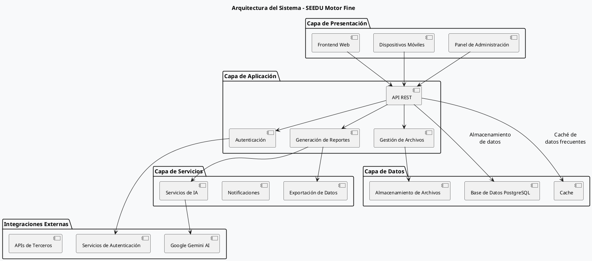
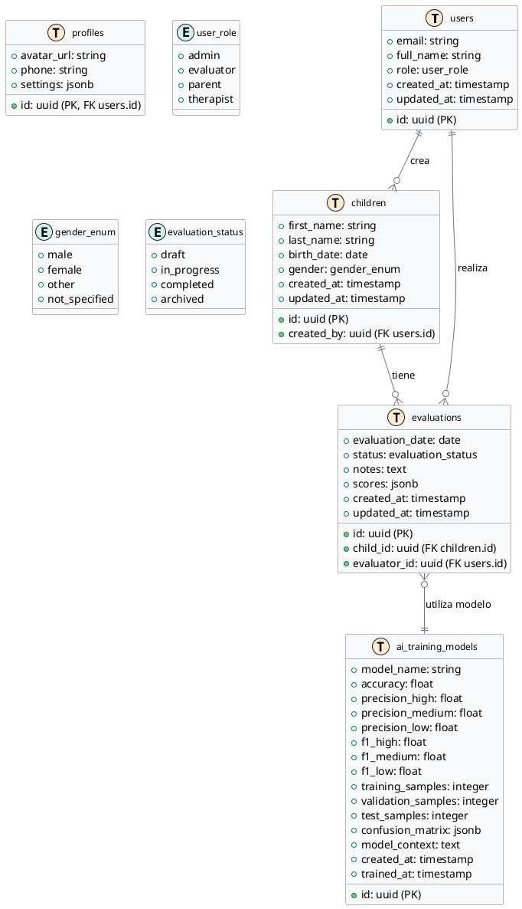

# SEEDU Motor Fine - Manual Técnico

## 🔧 Documentación Técnica Completa

**Versión:** 1.0.0  
**Tecnologías:** React 18.3.1, TypeScript, Supabase, TailwindCSS  
**Última actualización:** Noviembre 2025

---

## 1. Arquitectura del Sistema

### 1.1 Arquitectura General

```
┌─────────────────────────────────────────┐
│         FRONTEND (React + Vite)         │
│  ┌───────────────────────────────────┐  │
│  │  UI Components (Shadcn/ui)        │  │
│  │  Pages (React Router)             │  │
│  │  State Management (React Query)   │  │
│  └───────────────────────────────────┘  │
└─────────────────┬───────────────────────┘
                  │ HTTP/WebSocket
                  ▼
┌─────────────────────────────────────────┐
│       BACKEND (Supabase Cloud)          │
│  ┌───────────────────────────────────┐  │
│  │  PostgreSQL Database + RLS        │  │
│  │  Authentication (Supabase Auth)   │  │
│  │  Edge Functions (Deno)            │  │
│  │  Storage (Buckets)                │  │
│  └───────────────────────────────────┘  │
└─────────────────────────────────────────┘
```

## 2. Configuración de Supabase

### 2.1 Variables de Entorno Requeridas

El proyecto utiliza las siguientes variables de entorno que deben configurarse en el archivo `.env`:

```env
# Credenciales de Supabase
VITE_SUPABASE_URL=tu_url_de_supabase
VITE_SUPABASE_ANON_KEY=tu_clave_anonima
VITE_SUPABASE_PUBLISHABLE_KEY=tu_clave_publica
VITE_SUPABASE_PROJECT_ID=tu_id_de_proyecto

# Integraciones con APIs Externas
GEMINI_API_KEY=tu_clave_de_gemini
GOOGLE_API_KEY=tu_clave_de_google
```

### 2.2 Configuración de Secrets en Supabase

Los secrets sensibles se deben configurar en el dashboard de Supabase:

```bash
# Configurar un secreto
supabase secrets set NOMBRE_SECRETO=valor_secreto

# Ver secrets configurados
supabase secrets list
```

### 2.3 Edge Functions

El proyecto utiliza las siguientes Edge Functions:

#### 2.3.1 generate-suggestions
- **Propósito**: Genera sugerencias de actividades basadas en los resultados de las evaluaciones
- **Variables de Entorno Requeridas**:
  - `GEMINI_API_KEY`: Clave de la API de Google Gemini
  - `SUPABASE_SERVICE_ROLE_KEY`: Clave de servicio de Supabase

**Ejemplo de Uso**:
```typescript
const { data, error } = await supabase.functions.invoke('generate-suggestions', {
  body: { evaluationId: '123' }
})
```

#### 2.3.2 process-evaluation
- **Propósito**: Procesa los resultados de las evaluaciones
- **Variables de Entorno**:
  - `ANALYTICS_API_KEY`: Clave para la API de análisis

### 2.4 Configuración de RLS (Row Level Security)

Todas las tablas tienen habilitado RLS. A continuación se detallan las políticas principales:

```sql
-- Ejemplo de política para la tabla 'evaluations'
CREATE POLICY "Usuarios solo pueden ver sus propias evaluaciones"
ON public.evaluations FOR SELECT
USING (auth.uid() = evaluator_id);

CREATE POLICY "Usuarios solo pueden crear evaluaciones propias"
ON public.evaluations FOR INSERT
WITH CHECK (auth.uid() = evaluator_id);
```

### 2.5 Configuración de Almacenamiento

El proyecto utiliza los siguientes buckets de almacenamiento:

1. **evaluation-documents**: Para documentos de evaluación
2. **profile-pictures**: Para imágenes de perfil de usuarios
3. **reports**: Para reportes generados

Configuración de políticas de almacenamiento:

```sql
-- Ejemplo de política para profile-pictures
CREATE POLICY "Usuarios pueden ver solo sus propias imágenes de perfil"
ON storage.objects FOR SELECT
USING (bucket_id = 'profile-pictures' AND auth.uid()::text = (storage.foldername(name))[1]);
```

### 2.6 Configuración de Autenticación

El sistema utiliza Supabase Auth con los siguientes proveedores:
- Email/Contraseña
- Google OAuth
- GitHub OAuth (para desarrolladores)

Configuración en `src/integrations/supabase/client.ts`:

```typescript
import { createClient } from '@supabase/supabase-js'

const supabaseUrl = import.meta.env.VITE_SUPABASE_URL
const supabaseAnonKey = import.meta.env.VITE_SUPABASE_ANON_KEY

export const supabase = createClient(supabaseUrl, supabaseAnonKey, {
  auth: {
    autoRefreshToken: true,
    persistSession: true,
    detectSessionInUrl: true
  }
})
```

### 2.7 Despliegue

Para desplegar cambios en Supabase:

```bash
# Iniciar sesión
supabase login

# Vincular proyecto
supabase link --project-ref $SUPABASE_PROJECT_ID

# Desplegar migraciones
supabase db push

# Desplegar Edge Functions
supabase functions deploy --project-ref $SUPABASE_PROJECT_ID

# Configurar variables de entorno
supabase secrets set --env-file .env
```

### 2.8 Monitoreo y Logs

Para monitorear el rendimiento:

```bash
# Ver logs de autenticación
supabase logs --type auth

# Ver logs de base de datos
supabase logs --type database

# Ver logs de Edge Functions
supabase functions logs <function-name>
```

### 2.9 Seguridad

Recomendaciones de seguridad:

1. **Rotación de Claves**: Rotar regularmente las claves de API
2. **Manejo de Secrets**: No incluir secrets en el código fuente
3. **Políticas de RLS**: Revisar periódicamente las políticas de RLS
4. **Monitoreo**: Revisar regularmente los logs de acceso

### 2.10 Solución de Problemas Comunes

**Error: "Invalid API Key"**
1. Verificar que las variables de entorno estén configuradas correctamente
2. Asegurarse de que la clave tenga los permisos necesarios
3. Verificar que no haya espacios en blanco en las variables

**Error: "RLS Violation"**
1. Verificar que el usuario esté autenticado
2. Revisar las políticas de RLS para la tabla
3. Verificar que el usuario tenga los permisos necesarios

## 3. Stack Tecnológico

**Frontend:**
- React 18.3.1 con TypeScript
- Vite 5.x como build tool
- TailwindCSS 3.x para estilos
- Shadcn/ui para componentes UI
- React Router DOM 6.x para navegación
- React Hook Form + Zod para formularios y validación
- Recharts para visualización de datos
- jsPDF para generación de PDFs
- XLSX para exportación Excel

## 4. Diagramas de Arquitectura

### 4.1 Arquitectura del Sistema



### 4.2 Modelo de Datos



**Nota:** Para visualizar estos diagramas, necesitarás un renderizador de PlantUML. Puedes usar extensiones de VS Code como "PlantUML" o servicios en línea como PlantUML Web Server.

**Backend:**
- Supabase (BaaS - Backend as a Service)
- PostgreSQL 15+ como base de datos
- Deno Runtime para Edge Functions
- Row Level Security (RLS) para seguridad

**DevOps:**
- Git para control de versiones
- Netlify para deployment frontend
- Supabase Cloud para backend

---

## 4. Configuración del Entorno

### 4.1 Instalación Local

```bash
# Clonar el repositorio
git clone [URL_DEL_REPOSITORIO]
cd seedu-motor-fine

# Instalar dependencias
npm install

# Configurar variables de entorno
# Crear archivo .env en la raíz del proyecto
VITE_SUPABASE_URL=your_supabase_url
VITE_SUPABASE_ANON_KEY=your_supabase_anon_key

# Iniciar servidor de desarrollo
npm run dev

# Compilar para producción
npm run build

# Preview de build de producción
npm run preview
```

### 4.2 Configuración de Supabase

**Cliente de Supabase (`src/integrations/supabase/client.ts`):**

```typescript
import { createClient } from '@supabase/supabase-js';
import type { Database } from './types';

const SUPABASE_URL = import.meta.env.VITE_SUPABASE_URL;
const SUPABASE_ANON_KEY = import.meta.env.VITE_SUPABASE_ANON_KEY;

export const supabase = createClient<Database>(SUPABASE_URL, SUPABASE_ANON_KEY);
```

### 4.3 Estructura de Archivos

```
src/
├── components/
│   ├── evaluations/
│   │   ├── EvaluationForm.tsx          # Formulario principal de evaluación
│   │   └── PDFGenerator.tsx            # Lógica de generación PDF
│   └── ui/                              # Componentes Shadcn/ui
│       ├── button.tsx
│       ├── card.tsx
│       ├── form.tsx
│       ├── input.tsx
│       ├── select.tsx
│       ├── table.tsx
│       └── ... (40+ componentes)
├── pages/
│   ├── Auth.tsx                         # Autenticación
│   ├── Dashboard.tsx                    # Dashboard principal
│   ├── Children.tsx                     # CRUD de niños
│   ├── Evaluations.tsx                  # CRUD de evaluaciones
│   ├── Reports.tsx                      # Visualización de reportes
│   ├── Profile.tsx                      # Perfil de usuario
│   ├── AITraining.tsx                   # Entrenamiento IA
│   ├── LearningStyleAssessment.tsx      # Evaluación estilos
│   └── NotFound.tsx                     # Página 404
├── integrations/
│   └── supabase/
│       ├── client.ts                    # Cliente configurado
│       └── types.ts                     # Tipos autogenerados
├── hooks/
│   ├── use-mobile.tsx                   # Detección de dispositivos móviles
│   └── use-toast.ts                     # Sistema de notificaciones
├── lib/
│   └── utils.ts                         # Utilidades (cn, etc.)
├── App.tsx                              # Componente raíz con rutas
├── main.tsx                             # Punto de entrada
└── index.css                            # Estilos globales + tokens

supabase/
├── functions/
│   └── generate-suggestions/
│       └── index.ts                     # Edge Function para IA
├── migrations/
│   └── [timestamp]_initial_schema.sql   # Migraciones DB
└── config.toml                          # Configuración Supabase
```

---

## 5. Base de Datos

### 5.1 Modelo de Datos Completo

```sql
-- Tabla: profiles
CREATE TABLE public.profiles (
    id UUID PRIMARY KEY REFERENCES auth.users ON DELETE CASCADE,
    full_name TEXT,
    role TEXT DEFAULT 'evaluator',
    institution TEXT,
    created_at TIMESTAMP WITH TIME ZONE DEFAULT NOW(),
    updated_at TIMESTAMP WITH TIME ZONE DEFAULT NOW()
);

-- Tabla: children
CREATE TABLE public.children (
    id UUID PRIMARY KEY DEFAULT gen_random_uuid(),
    evaluator_id UUID REFERENCES public.profiles(id) ON DELETE CASCADE,
    name TEXT NOT NULL,
    birth_date DATE NOT NULL,
    gender TEXT,
    grade TEXT,
    school TEXT,
    created_at TIMESTAMP WITH TIME ZONE DEFAULT NOW(),
    updated_at TIMESTAMP WITH TIME ZONE DEFAULT NOW()
);

-- Tabla: evaluations
CREATE TABLE public.evaluations (
    id UUID PRIMARY KEY DEFAULT gen_random_uuid(),
    child_id UUID REFERENCES public.children(id) ON DELETE CASCADE,
    evaluator_id UUID REFERENCES public.profiles(id) ON DELETE CASCADE,
    evaluation_date DATE DEFAULT CURRENT_DATE,
    test_1_score INTEGER CHECK (test_1_score >= 0 AND test_1_score <= 10),
    test_1_observations TEXT,
    test_2_score INTEGER CHECK (test_2_score >= 0 AND test_2_score <= 10),
    test_2_observations TEXT,
    test_3_score INTEGER CHECK (test_3_score >= 0 AND test_3_score <= 10),
    test_3_observations TEXT,
    test_4_score INTEGER CHECK (test_4_score >= 0 AND test_4_score <= 10),
    test_4_observations TEXT,
    test_5_score INTEGER CHECK (test_5_score >= 0 AND test_5_score <= 10),
    test_5_observations TEXT,
    test_6_score INTEGER CHECK (test_6_score >= 0 AND test_6_score <= 10),
    test_6_observations TEXT,
    test_7_score INTEGER CHECK (test_7_score >= 0 AND test_7_score <= 10),
    test_7_observations TEXT,
    test_8_score INTEGER CHECK (test_8_score >= 0 AND test_8_score <= 10),
    test_8_observations TEXT,
    observations TEXT,
    created_at TIMESTAMP WITH TIME ZONE DEFAULT NOW(),
    updated_at TIMESTAMP WITH TIME ZONE DEFAULT NOW()
);

-- Tabla: ai_results
CREATE TABLE public.ai_results (
    id UUID PRIMARY KEY DEFAULT gen_random_uuid(),
    evaluation_id UUID REFERENCES public.evaluations(id) ON DELETE CASCADE,
    classification TEXT CHECK (classification IN ('Alto', 'Medio', 'Bajo')),
    confidence_score NUMERIC(5,2) CHECK (confidence_score >= 0 AND confidence_score <= 100),
    recommendations TEXT,
    created_at TIMESTAMP WITH TIME ZONE DEFAULT NOW()
);

-- Tabla: ai_training_models
CREATE TABLE public.ai_training_models (
    id UUID PRIMARY KEY DEFAULT gen_random_uuid(),
    model_name TEXT NOT NULL,
    training_samples INTEGER NOT NULL,
    validation_samples INTEGER NOT NULL,
    test_samples INTEGER NOT NULL,
    accuracy NUMERIC(5,2),
    precision_high NUMERIC(5,2),
    precision_medium NUMERIC(5,2),
    precision_low NUMERIC(5,2),
    f1_high NUMERIC(5,2),
    f1_medium NUMERIC(5,2),
    f1_low NUMERIC(5,2),
    confusion_matrix JSONB,
    training_time_seconds NUMERIC(10,2),
    created_by UUID REFERENCES public.profiles(id),
    trained_at TIMESTAMP WITH TIME ZONE DEFAULT NOW(),
    created_at TIMESTAMP WITH TIME ZONE DEFAULT NOW()
);

-- Tabla: learning_style_assessments
CREATE TABLE public.learning_style_assessments (
    id UUID PRIMARY KEY DEFAULT gen_random_uuid(),
    child_id UUID REFERENCES public.children(id) ON DELETE CASCADE,
    evaluator_id UUID REFERENCES public.profiles(id) ON DELETE CASCADE,
    assessment_date DATE DEFAULT CURRENT_DATE,
    responses JSONB NOT NULL,
    visual_score NUMERIC(5,2),
    auditory_score NUMERIC(5,2),
    kinesthetic_score NUMERIC(5,2),
    logical_score NUMERIC(5,2),
    social_score NUMERIC(5,2),
    solitary_score NUMERIC(5,2),
    dominant_style TEXT,
    secondary_style TEXT,
    analysis_notes TEXT,
    created_at TIMESTAMP WITH TIME ZONE DEFAULT NOW(),
    updated_at TIMESTAMP WITH TIME ZONE DEFAULT NOW()
);

-- Tabla: user_roles
CREATE TABLE public.user_roles (
    id UUID PRIMARY KEY DEFAULT gen_random_uuid(),
    user_id UUID NOT NULL,
    role app_role NOT NULL,
    created_at TIMESTAMP WITH TIME ZONE DEFAULT NOW()
);

-- Enum: app_role
CREATE TYPE app_role AS ENUM ('admin', 'evaluator');
```

### 5.2 Row Level Security (RLS)

**Políticas implementadas:**

```sql
-- Policies para profiles
ALTER TABLE public.profiles ENABLE ROW LEVEL SECURITY;

CREATE POLICY "Users can view own profile"
    ON public.profiles FOR SELECT
    USING (auth.uid() = id);

CREATE POLICY "Users can insert own profile"
    ON public.profiles FOR INSERT
    WITH CHECK (auth.uid() = id);

CREATE POLICY "Users can update own profile"
    ON public.profiles FOR UPDATE
    USING (auth.uid() = id);

-- Policies para children
ALTER TABLE public.children ENABLE ROW LEVEL SECURITY;

CREATE POLICY "Users can view own children"
    ON public.children FOR SELECT
    USING (evaluator_id = auth.uid());

CREATE POLICY "Users can insert own children"
    ON public.children FOR INSERT
    WITH CHECK (evaluator_id = auth.uid());

CREATE POLICY "Users can update own children"
    ON public.children FOR UPDATE
    USING (evaluator_id = auth.uid());

CREATE POLICY "Users can delete own children"
    ON public.children FOR DELETE
    USING (evaluator_id = auth.uid());

-- Policies similares para evaluations, ai_results, learning_style_assessments
```

### 5.3 Índices para Optimización

```sql
-- Índices en children
CREATE INDEX idx_children_evaluator_id ON public.children(evaluator_id);
CREATE INDEX idx_children_name ON public.children(name);

-- Índices en evaluations
CREATE INDEX idx_evaluations_child_id ON public.evaluations(child_id);
CREATE INDEX idx_evaluations_evaluator_id ON public.evaluations(evaluator_id);
CREATE INDEX idx_evaluations_date ON public.evaluations(evaluation_date);

-- Índices en ai_results
CREATE INDEX idx_ai_results_evaluation_id ON public.ai_results(evaluation_id);

-- Índices en learning_style_assessments
CREATE INDEX idx_lsa_child_id ON public.learning_style_assessments(child_id);
CREATE INDEX idx_lsa_evaluator_id ON public.learning_style_assessments(evaluator_id);
```

---

## 6. Edge Functions

### 6.1 generate-suggestions

**Ubicación:** `supabase/functions/generate-suggestions/index.ts`

**Propósito:** Analizar resultados de evaluación y generar clasificación + recomendaciones mediante IA

**Entrada:**
```typescript
{
  evaluationId: string;
  scores: number[]; // Array de 8 puntajes (0-10)
}
```

**Salida:**
```typescript
{
  classification: "Alto" | "Medio" | "Bajo";
  confidence: number; // 0-100
  recommendations: string;
}
```

**Algoritmo de Clasificación:**

```typescript
const average = scores.reduce((a, b) => a + b, 0) / scores.length;

let classification: string;
if (average >= 8) classification = "Alto";
else if (average >= 5) classification = "Medio";
else classification = "Bajo";

const confidence = calculateConfidence(scores, classification);
```

**Deployment:**

```bash
# Deployar función
supabase functions deploy generate-suggestions

# Ver logs
supabase functions logs generate-suggestions

# Invocar manualmente para testing
supabase functions invoke generate-suggestions --data '{"evaluationId":"uuid","scores":[8,9,7,8,9,8,7,9]}'
```

---

## 7. Componentes Principales

### 7.1 EvaluationForm Component

**Ubicación:** `src/components/evaluations/EvaluationForm.tsx`

**Props:**
```typescript
interface EvaluationFormProps {
  childId: string;
  onSuccess?: () => void;
}
```

**Funcionalidades:**
- Formulario con 8 campos de puntuación (0-10)
- Campo de observaciones por prueba
- Validación con Zod
- Submit asíncrono con React Hook Form
- Llamada automática a Edge Function tras guardar
- Manejo de errores con toast notifications

**Flujo:**
1. Usuario completa 8 pruebas
2. Submit → Inserta en tabla `evaluations`
3. Llama Edge Function `generate-suggestions`
4. Edge Function inserta en tabla `ai_results`
5. Muestra notificación de éxito

### 7.2 PDFGenerator Component

**Ubicación:** `src/components/evaluations/PDFGenerator.tsx`

**Tecnología:** jsPDF + jsPDF-AutoTable

**Estructura del PDF:**
1. Header con logo y título
2. Información del niño
3. Tabla de resultados por prueba
4. Gráfico de barras (convertido a imagen)
5. Análisis de IA (clasificación + confianza)
6. Recomendaciones personalizadas
7. Fecha y firma del evaluador

**Uso:**
```typescript
import { generatePDF } from '@/components/evaluations/PDFGenerator';

generatePDF(evaluation, child, aiResult, evaluatorName);
```

### 7.3 Dashboard Component

**Ubicación:** `src/pages/Dashboard.tsx`

**Métricas mostradas:**
- Total de niños registrados
- Total de evaluaciones realizadas
- Promedio general de puntuación
- Distribución de clasificaciones IA (Alto/Medio/Bajo)

**Queries con React Query:**
```typescript
const { data: children } = useQuery({
  queryKey: ['children'],
  queryFn: async () => {
    const { data } = await supabase
      .from('children')
      .select('*')
      .eq('evaluator_id', user.id);
    return data;
  }
});
```

---

## 8. Guía de Estilos

### 8.1 Tokens de Diseño

**Ubicación:** `src/index.css`

```css
@layer base {
  :root {
    --background: 0 0% 100%;
    --foreground: 222.2 84% 4.9%;
    --primary: 221.2 83.2% 53.3%;
    --primary-foreground: 210 40% 98%;
    --secondary: 210 40% 96.1%;
    --muted: 210 40% 96.1%;
    --accent: 210 40% 96.1%;
    --destructive: 0 84.2% 60.2%;
    --border: 214.3 31.8% 91.4%;
    --input: 214.3 31.8% 91.4%;
    --ring: 221.2 83.2% 53.3%;
    --radius: 0.5rem;
  }
}
```

### 6.2 Configuración TailwindCSS

**Ubicación:** `tailwind.config.ts`

```typescript
export default {
  darkMode: ["class"],
  content: [
    './pages/**/*.{ts,tsx}',
    './components/**/*.{ts,tsx}',
    './app/**/*.{ts,tsx}',
    './src/**/*.{ts,tsx}',
  ],
  theme: {
    extend: {
      colors: {
        border: "hsl(var(--border))",
        background: "hsl(var(--background))",
        foreground: "hsl(var(--foreground))",
        primary: {
          DEFAULT: "hsl(var(--primary))",
          foreground: "hsl(var(--primary-foreground))",
        },
        // ... más colores
      },
      borderRadius: {
        lg: "var(--radius)",
        md: "calc(var(--radius) - 2px)",
        sm: "calc(var(--radius) - 4px)",
      },
    },
  },
  plugins: [require("tailwindcss-animate")],
}
```

---

## 7. Deployment

### 7.1 Frontend (Netlify)

**Archivo de configuración:** `public/_redirects`

```
/*    /index.html   200
```

**Build settings:**
```bash
Build command: npm run build
Publish directory: dist
```

**Variables de entorno en Netlify:**
```
VITE_SUPABASE_URL=https://your-project.supabase.co
VITE_SUPABASE_ANON_KEY=your-anon-key
```

### 7.2 Backend (Supabase)

**Configuración en `supabase/config.toml`:**

```toml
[api]
enabled = true
port = 54321
schemas = ["public"]
max_rows = 1000

[db]
port = 54322

[studio]
enabled = true
port = 54323
```

**Deploy de Edge Functions:**
```bash
supabase functions deploy generate-suggestions --project-ref your-project-ref
```

---

## 9. Testing y Debugging

### 8.1 Console Logs

Activar logs detallados:
```typescript
console.log('[DEBUG]', 'Mensaje de debug');
console.error('[ERROR]', error);
```

### 8.2 React Query Devtools

```typescript
import { ReactQueryDevtools } from '@tanstack/react-query-devtools';

<QueryClientProvider client={queryClient}>
  <App />
  <ReactQueryDevtools initialIsOpen={false} />
</QueryClientProvider>
```

### 8.3 Supabase Logs

```bash
# Ver logs en tiempo real
supabase functions logs generate-suggestions --follow

# Ver logs de base de datos
supabase db logs
```

---

## 10. Mantenimiento

### 9.1 Actualización de Dependencias

```bash
# Ver dependencias desactualizadas
npm outdated

# Actualizar dependencias
npm update

# Actualizar versión mayor (con precaución)
npm install package@latest
```

### 9.2 Migraciones de Base de Datos

```bash
# Crear nueva migración
supabase migration new migration_name

# Aplicar migraciones
supabase db push

# Rollback
supabase db reset
```

### 9.3 Backup de Base de Datos

```bash
# Exportar esquema
supabase db dump --schema public > backup.sql

# Restaurar
psql -h db.your-project.supabase.co -U postgres -d postgres < backup.sql
```

---

## 11. Troubleshooting

### 10.1 Problemas Comunes

**Error: 404 en páginas al recargar**
- Solución: Verificar archivo `_redirects` en carpeta `public/`

**Error: RLS políticas bloquean acceso**
- Verificar que `auth.uid()` coincide con `evaluator_id`
- Revisar políticas con: `SELECT * FROM pg_policies WHERE tablename = 'children';`

**Edge Function no responde**
- Verificar logs: `supabase functions logs generate-suggestions`
- Verificar deployment: `supabase functions list`

**Tipos de TypeScript desactualizados**
- Regenerar: `supabase gen types typescript --project-id your-project-id > src/integrations/supabase/types.ts`

---

## 12. API Reference

### 11.1 Supabase Client Methods

```typescript
// SELECT
const { data, error } = await supabase
  .from('children')
  .select('*')
  .eq('evaluator_id', userId);

// INSERT
const { data, error } = await supabase
  .from('children')
  .insert({ name: 'Juan', birth_date: '2015-05-20' });

// UPDATE
const { data, error } = await supabase
  .from('children')
  .update({ name: 'Juan Pérez' })
  .eq('id', childId);

// DELETE
const { data, error } = await supabase
  .from('children')
  .delete()
  .eq('id', childId);

// JOIN
const { data, error } = await supabase
  .from('evaluations')
  .select(`
    *,
    children (name, birth_date),
    ai_results (classification, recommendations)
  `)
  .eq('evaluator_id', userId);
```

---

## 13. Seguridad

### 12.1 Mejores Prácticas

- ✅ Nunca exponer SUPABASE_SERVICE_KEY en frontend
- ✅ Usar RLS en todas las tablas
- ✅ Validar inputs con Zod
- ✅ Sanitizar datos antes de insertar
- ✅ Usar prepared statements (automático en Supabase)
- ✅ Implementar rate limiting en Edge Functions
- ✅ Mantener dependencias actualizadas

### 12.2 Auditoría de Seguridad

```sql
-- Ver todas las políticas RLS
SELECT schemaname, tablename, policyname, permissive, roles, cmd, qual
FROM pg_policies
WHERE schemaname = 'public';

-- Verificar tablas sin RLS
SELECT tablename
FROM pg_tables
WHERE schemaname = 'public'
AND tablename NOT IN (
    SELECT tablename FROM pg_policies WHERE schemaname = 'public'
);
```

---

## 13. Performance

### 13.1 Optimizaciones Implementadas

- React.lazy() para code splitting
- React Query con cache inteligente
- Índices en columnas de búsqueda frecuente
- Paginación en listas grandes
- Debounce en búsquedas
- Memoización con useMemo/useCallback

### 13.2 Monitoring

```typescript
// Medir tiempo de queries
console.time('fetch-children');
const { data } = await supabase.from('children').select('*');
console.timeEnd('fetch-children');
```

---

## Anexos

### A. Scripts Útiles

```json
{
  "scripts": {
    "dev": "vite",
    "build": "tsc && vite build",
    "preview": "vite preview",
    "lint": "eslint . --ext ts,tsx --report-unused-disable-directives --max-warnings 0",
    "type-check": "tsc --noEmit"
  }
}
```

### B. Variables de Entorno

```env
VITE_SUPABASE_URL=https://xxxxx.supabase.co
VITE_SUPABASE_ANON_KEY=eyJhbGci...
```

---

**Fin del Manual Técnico**
